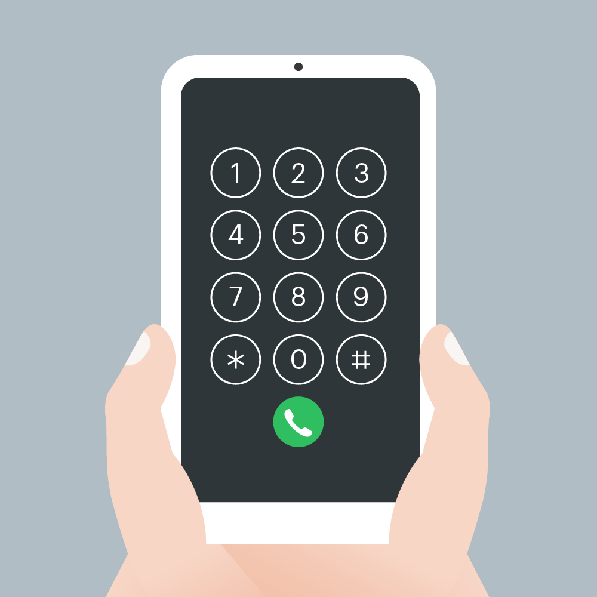

## 문제
스마트폰 전화 키패드의 각 칸에 다음과 같이 숫자들이 적혀 있습니다.



이 전화 키패드에서 왼손과 오른손의 엄지손가락만을 이용해서 숫자만을 입력하려고 합니다.
맨 처음 왼손 엄지손가락은 * 키패드에 오른손 엄지손가락은 # 키패드 위치에서 시작하며, 엄지손가락을 사용하는 규칙은 다음과 같습니다.

- 엄지손가락은 상하좌우 4가지 방향으로만 이동할 수 있으며 키패드 이동 한 칸은 거리로 1에 해당합니다.
- 왼쪽 열의 3개의 숫자 1, 4, 7을 입력할 때는 왼손 엄지손가락을 사용합니다.
- 오른쪽 열의 3개의 숫자 3, 6, 9를 입력할 때는 오른손 엄지손가락을 사용합니다.
- 가운데 열의 4개의 숫자 2, 5, 8, 0을 입력할 때는 두 엄지손가락의 현재 키패드의 위치에서 더 가까운 엄지손가락을 사용합니다.
  - 만약 두 엄지손가락의 거리가 같다면, 오른손잡이는 오른손 엄지손가락, 왼손잡이는 왼손 엄지손가락을 사용합니다.

순서대로 누를 번호가 담긴 배열 numbers, 왼손잡이인지 오른손잡이인 지를 나타내는 문자열 hand가 매개변수로 주어질 때, 각 번호를 누른 엄지손가락이 왼손인 지 오른손인 지를 나타내는 연속된 문자열 형태로 return 하도록 solution 함수를 완성해주세요.

## 제한 사항
- numbers 배열의 크기는 1 이상 1,000 이하입니다.
- numbers 배열 원소의 값은 0 이상 9 이하인 정수입니다.
- hand는 "left" 또는 "right" 입니다.
  - "left"는 왼손잡이, "right"는 오른손잡이를 의미합니다.
- 왼손 엄지손가락을 사용한 경우는 L, 오른손 엄지손가락을 사용한 경우는 R을 순서대로 이어붙여 문자열 형태로 return 해주세요.

## 입출력 예
|numbers|hand|result|
|:-:|:-:|:-:|
|[1, 3, 4, 5, 8, 2, 1, 4, 5, 9, 5]|right|LRLLLRLLRRL|
|[7, 0, 8, 2, 8, 3, 1, 5, 7, 6, 2]|left|LRLLRRLLLRR|
|[1, 2, 3, 4, 5, 6, 7, 8, 9, 0]|right|LLRLLRLLRL|

## 문제풀이

```py
def solution(numbers, hand):
    leftSide = [1,4,7,None]
    midSide = [2,5,8,0]
    rightSide = [3,6,9,None]
    
    left = None
    right = None
    answer = ''
    
    def getDistance(fr, to):
        distance = 0
        if fr == to:
            return distance
        if fr in leftSide:
            distance += 1
            frIdx = leftSide.index(fr)
        elif fr in rightSide:
            distance += 1
            frIdx = rightSide.index(fr)
        else:
            frIdx = midSide.index(fr)
        toIdx = midSide.index(to)
        distance += abs(frIdx - toIdx)
        return distance
    
    for num in numbers:
        if num in leftSide:
            answer += 'L'
        elif num in rightSide:
            answer += 'R'
        else:
            leftDistance = getDistance(left, num)
            rightDistance = getDistance(right, num)
            if leftDistance == rightDistance:
                if hand == 'left':
                    answer += 'L'
                else:
                    answer += 'R'
            elif leftDistance < rightDistance:
                answer += 'L'
            else:
                answer += 'R'
                
        if answer[-1] == 'L':
            left = num
        else:
            right = num
            
    return answer
```

이 문제는 2가지 로직이 있으면 된다고 생각했다.

- 왼쪽열, 오른쪽열의 숫자일 경우 L 또는 R을 answer 문자열에 추가
- 가운데열의 경우 left, right 손의 위치 거리를 비교하는 로직으로 문자열 추가

leftSide, rightSide, midSide 배열을 만들어주고 *, # 은 None으로 처리해서 자판 배열과 동일한 배열위치로 생성한다.
```py
leftSide = [1,4,7,None]
midSide = [2,5,8,0]
rightSide = [3,6,9,None]
```
그리고 손의 위치를 저장할 `left=None`, `right=None`를 만들어주고 나중에 반환할 answer를 마지막 변수로 만들었다.<br/>
첫번째 인자로 들어온 numbers를 for loop으로 돌리고 위 요약한 로직 1번째일 경우 L, R을 쉽게 추가하고 두번째인 가운데열에 해당하는 숫자일 경우 `getDistance` 로직을 통해 거리를 구하게되는데 문제내용을 보면 손은 상하좌우로만 움직이기때문에 왼쪽열 오른쪽열에 손이 위치할 경우 +1 거리만 늘려주면된다. 그래서 결국 가운데열의 숫자 index를 from, to로 해서 계산을 하면 수식은 `(1 || 0) + abs(frIdx - toIdx)` 가 된다.<br/>
이 거리를 구한 것을 가지고 비교를 다시해서 answer에 넣을 string을 추가하고 마지막에 `answer[-1]` 값을 보고 손의 위치를 각 새로운 값으로 바꿔주면 된다.

----

[참고: 문제링크](https://programmers.co.kr/learn/courses/30/lessons/67256)
