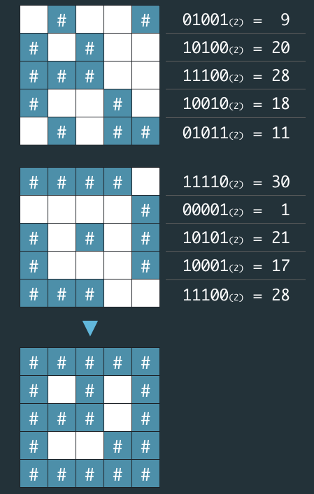

## 문제
비밀지도
네오는 평소 프로도가 비상금을 숨겨놓는 장소를 알려줄 비밀지도를 손에 넣었다. 그런데 이 비밀지도는 숫자로 암호화되어 있어 위치를 확인하기 위해서는 암호를 해독해야 한다. 다행히 지도 암호를 해독할 방법을 적어놓은 메모도 함께 발견했다.

- 지도는 한 변의 길이가 n인 정사각형 배열 형태로, 각 칸은 공백(" ) 또는벽(#") 두 종류로 이루어져 있다.
- 전체 지도는 두 장의 지도를 겹쳐서 얻을 수 있다. 각각 지도 1과 지도 2라고 하자. 지도 1 또는 지도 2 중 어느 하나라도 벽인 부분은 전체 지도에서도 벽이다. 지도 1과 지도 2에서 모두 공백인 부분은 전체 지도에서도 공백이다.
- 지도 1과 지도 2는 각각 정수 배열로 암호화되어 있다.
- 암호화된 배열은 지도의 각 가로줄에서 벽 부분을 1, 공백 부분을 0으로 부호화했을 때 얻어지는 이진수에 해당하는 값의 배열이다.

<br/>



<br/>

네오가 프로도의 비상금을 손에 넣을 수 있도록, 비밀지도의 암호를 해독하는 작업을 도와줄 프로그램을 작성하라.

## 입력 형식

입력으로 지도의 한 변 크기 n 과 2개의 정수 배열 arr1, arr2가 들어온다.

- 1 ≦ n ≦ 16
- arr1, arr2는 길이 n인 정수 배열로 주어진다.
- 정수 배열의 각 원소 x를 이진수로 변환했을 때의 길이는 n 이하이다. 즉, 0 ≦ x ≦ 2n - 1을 만족한다.


## 출력 형식

원래의 비밀지도를 해독하여 '#', 공백으로 구성된 문자열 배열로 출력하라.

## 입출력 예
|매개변수|값|
|:-:|:-:|
|n|5|
|arr1|[9, 20, 28, 18, 11]|
|arr2|[30, 1, 21, 17, 28]|
|출력|["#####","# # #", "### #", "# ##", "#####"]|

|매개변수|값|
|:-:|:-:|
|n|6|
|arr1|[46, 33, 33 ,22, 31, 50]|
|arr2|[27 ,56, 19, 14, 14, 10]|
|출력|["######", "### #", "## ##", " #### ", " #####", "### # "]|

## 문제 풀이 - 1 (처음으로 했던 풀이)
```py
def solution(n, arr1, arr2):
  answer = []
  for i, j in zip(arr1, arr2):
    arr1Binary=bin(i)[2:]
    arr1Binary='0' * (n - len(arr1Binary)) + arr1Binary
    
    arr2Binary=bin(j)[2:]
    arr2Binary='0' * (n - len(arr2Binary)) + arr2Binary
    
    mapStr = ''
    for bi, bj in zip(arr1Binary, arr2Binary):
      if bi == '0' and bj == '0':
          mapStr += ' '
      else:
          mapStr += '#'
    answer.append(mapStr)

  return answer
```
array1, array2 는 같은 길이의 배열이 들어오기 때문에 zip으로 감싼뒤 loop을 돌려 값 i, j를 받고, 각 binary로 변환 하면 `0b` prefix가 붙어서 나오기때문에 `[2:]`로 제거하고, 첫 인자값인 n의 정수보다 길이가 적은 binary값이 나올 수도 있으므로, 앞에 `'0' * (n - len(arr1Binary))` 을 더한다.

마지막으로 각 binary 값을 zip loop을 돌리고 둘 다 0인 경우만 공백으로 바꾸고 나머지는 #으로 처리해서 answer 배열에 append 시키면 된다.

## 문제 풀이 - 2 (비트 연산자)
```py
def solution(n, arr1, arr2):
  answer = []
  for i,j in zip(arr1,arr2):
    a12 = str(bin(i|j)[2:])
    answer.append(
      a12.rjust(n,'0')
      .replace('1','#')
      .replace('0',' ')
    )
  return answer
```

|연산자|비트1|비트2|결과|
|:-:|:-:|:-:|:-:|
|&|0|0|0|
|&|0|1|0|
|&|1|0|0|
|&|1|1|1|

& 연산자는 비트 AND이므로 두 값이 모두 1일 때 1, 하나라도 0이면 0

|연산자|비트1|비트2|결과|
|:-:|:-:|:-:|:-:|
|ㅣ|0|0|0|
|ㅣ|0|1|1|
|ㅣ|1|0|1|
|ㅣ|1|1|1|

| 연산자는 비트 OR이므로 두 값중 하나라도 1일 때 1, 모두 0이면 0

비트연산자를 이용해서 `bin()` 함수에 i, j의 값을 넣는다. 그렇게하면 문제의 의도대로 모두 0일때 0이나오고 나머지는 1이 나온다. 앞의 문제풀이처럼 prefix `0b`를 지우고 `rjust` 함수로 n 만큼 0으로 채우고 string을 align right로 준다. 그러면 부족한 수만큼 0이 채워진다. 다음으로 1은 #, 0은 공백으로 replace하고 answer에 append로 마무리한다.

## 문제 풀이 - 3 (비트연산자 - Javascript)
```js
function solution(n, arr1, arr2) {
  return arr1.reduce((acc, v, i) => {
    const bin = (v | arr2[i])
      .toString(2)
      .padStart(n, '0')
      .replace(/0/g,' ')
      .replace(/1/g,'#');
    
    acc.push(bin);
    return acc;
  }, []);
}
```

두번째 문제풀이와 같이 비트연산자를 사용했다.

----

[참고: 문제링크](https://programmers.co.kr/learn/courses/30/lessons/17681)
