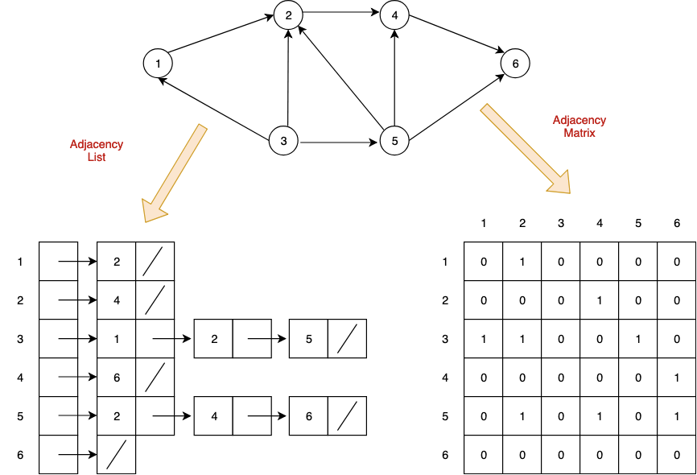
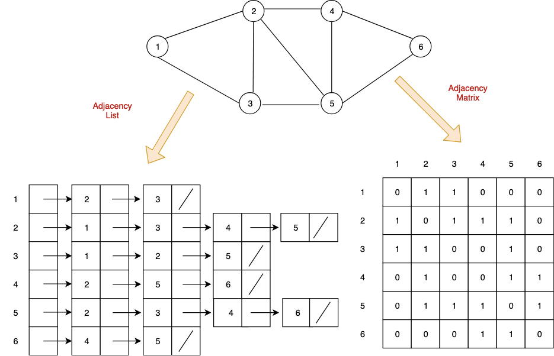
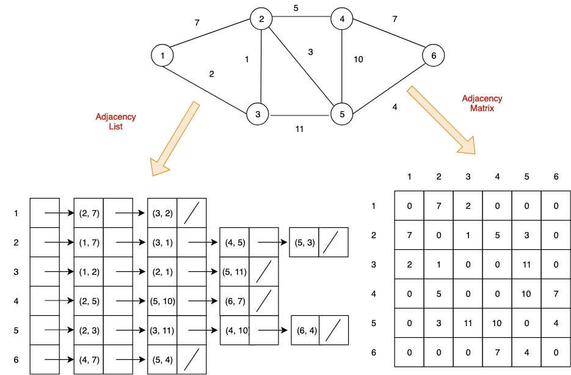

> 트리는 그래프의 한 형태이다.

### 그래프란?
노드와 그 노드를 연결하는 엣지, 간선을 하나로 모아 놓은 자료 구조를 말한다. 
지도, 지하철 노선도, 가족 관계도 등을 예로들 수 있다.

### 그래프의 종류 (Directed, Undirected, Cyclic, Acyclic, Weighted, UnWeighted, Spare, Dense)

#### Directed - Undirected
노드 간의 방향 유무로 나뉘어진다. 
- 도시 사이의 연결된 고속도로는 Undirected graph
- 일방통행 도로는 Directed graph

#### Cyclic - Acyclic
노드의 관계에 순환 유무로 나뉘어진다. 
그래프 알고리즘을 사용할 때 무한 루프를 감안한 알고리즘을 사용해야 되는 경우로 Cyclic graph에 적용된다.

> 트리의 경우 Root노드에서 children 자식노드로 한방향을 가지고 싸이클이 없는 그래프이다.

#### Weighted - Unweighted
노드 엣지, 간선에 가중치 유무로 나뉘어진다. 
- 어떤 도시로 가기위한, 고속도로 비용 또는 시간을 구하기 Weighted graph
- 어떤 역으로 가기위해 가장 적은 환승 경로를 구하기 Unweighted graph

> 가중 그래프는 일반적으로 경로 탐색 알고리즘에 사용되며 가중치 계산에 대한 고려가 필요하다.

#### Sparse - Dense
노드에 비해 관계가 많은 그래프를 Dense grpah라고 하고 반대로 Sparse graph는 노드에 비해 관계가 느슨한 것 연결 분포가 드문 것을 지칭한다.

### 그래프를 표현하는 방식 (Adjacency Matrix, Adjacency List)

|방향성 그래프|비방향성 그래프|가중치 그래프|
|:-:|:-:|:-:|
||||

- Adjacency Matrix - 그래프를 표에다가 표현.
- Adjacency List - 그래프를 배열(연결 리스트)에 표현.

> 무방향 그래프의 경우, 노드는 서로 엣지로 연결이 되어있기 때문에 엣지의 개수를 m이라고 하면, 2m 개의 노드를 갖는다.

#### 위 두가지 인접 리스트('Adjacency List')와 인접 행렬('Adjacency Matrix') 장단점

||장점|단점|
|:-:|:--|:--|
|인접 리스트, 희소 그래프(Spare Graph)일 경우|- 어떤 노드에 인접한 노드들을 쉽게 찾을 수 있다. - 인접 리스트 전체를 조사하는 경우, 그래프에 존재하는 모든 간선의 수는 O(N + E) 안에 알 수 있다.|- 간선의 존재 여부와 정점의 차수만큼 탐색에 시간이 필요하다.|
|인접 행렬, 밀집 그래프(Dense Graph)일 경우|- 두 정점을 연결하는 간선의 존재 여부를 O(1) 안에 즉시 알 수 있다. - 인접 배열의 I번 째 행 또는 열을 모두 더하면 되므로, 정점의 차수는 O(N) 안에 알 수 있다.|- 어떤 노드에 인접한 노드들을 찾기 위해서는 모든 노드를 전부 순회해야 한다. - 그래프에 존재하는 모든 간선의 수는 인접 행렬 전체를 조사해야 하므로 O(N2)안에 알 수 있다.|

>- 정점은 노드를 뜻하고, 정점의 차수는 무방향 그래프에서 하나의 정점 노드에 인접한 노드의 수를 뜻한다.
>- 인접 행렬은 노드의 개수에 따라 제곱에 해당하는 공간을 차지하고 인접 리스트는 노드의 개수와 엣지의 개수의 합에 해당하는 공간을 차지한다. 따라서 노드의 개수가 작으면 행렬을 크면 리스트를 사용하는게 효과적일 수 있다.

### 그래프 검색 방법 (DFS, BFS)

#### DFS - Depth-First Search, 깊이 우선 검색

하나의 자식 노드의 마지막 자식 노드까지 확인하고 다시 검색 첫 노드로 되돌아가고 처음 검색을 시작했던 자식노드의 형제 노드의 마지막 자식 노드까지 확인하는 작업을 반복하는 과정

DFS : Stack을 이용한다.
> DFS는 재귀호출을 사용하면 코드가 더욱 간결해진다.

사용하는 경우로는, 모든 노드를 방문 하고자 하는 경우에 이 방법을 선택한다.

#### BFS - Breadth-First Search, 넓이 우선 검색

시작점에서 자신의 자식 노드를 방문하고, 그 다음 레벨의 자식노드를 방문하는 작업을 반복하는 과정으로 즉 레벨별로 노드를 탐색한다.

BFS : Queue를 이용한다.

사용하는 경우로는, 두 노드 사이의 최단 경로 혹은 임의의 경로를 찾고 싶을 때 이 방법을 선택한다. (DFS로 탐색할 경우, 모든 노드 관계를 살펴봐야 할지도 모르기 때문이다.)

-----

### 출처
https://algorithmtutor.com/Data-Structures/Graph/Graph-Representation-Adjacency-List-and-Matrix/

https://neo4j.com/blog/graph-algorithms-neo4j-graph-algorithm-concepts/

https://www.youtube.com/watch?v=fVcKN42YXXI

https://gmlwjd9405.github.io/2018/08/13/data-structure-graph.html