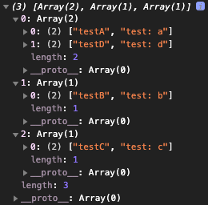
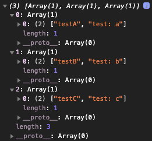

### 해시 테이블 이란?

어떤 특정 값을 받으면 그 값을 `해시 함수`에 통과시켜 나온 인덱스 값(key) 에 값 (value)을 저장하는 자료구조이다.<br/>

컴퓨터 공학에서는 `연관 배열(associative array)` 이라고 분류가 되기도 한다. (map, symbol table, dictionary가 해당한다.)

<table>
  <tbody>
    <tr>
      <td style="width: 50%">
        <div>
          <li>해시 함수와 배열을 결합해서 만든다.</li>
          <li>충돌을 줄일 수록 좋은 해시 테이블이 생성되므로, 충돌을 줄이는 해시 함수가 있어야 한다.</li>
          <li>빠른 탐색, 삽입, 삭제 속도를 가진다.</li>
          <li>어떤 항목과 다른 항목의 관계를 모형화하는 데 좋다.</li>
          <li>보통 사용률이 0.7 보다 커지면 해시 테이블을 리사이징 한다.</li>
          <li>데이터 캐싱(웹 서버)하는 데도 사용이 된다.</li>
          <li>중복을 잡아내는데 뛰어나다.</li>
        </div>
      </td>
      <td style="width: 50%">
        <div style="background:#fff; border: 1px solid #fff; border-radius: 5px;">
          
        </div>
      </td>
    </tr>
  </tbody>
</table>

#### 해시 테이블 장점
- 어떤 것과 다른 것 사이의 관계를 모형화할 수 있다.
- 중복을 막을 수 있다.
- 서버에게 작업을 시키지 않고 자료를 캐싱할 수 있다.

### 해시 함수란?
임의의 길이의 데이터를 고정된 길이의 데이터로 매핑하는 함수이다.<br />
해시 함수에서 반환하는 `고정된 길이의 데이터` 를 해시 (hash)라고 부른다.

- 같은 이름에 대해서는 항상 같은 인덱스를 할당한다.
- 다른 문자열에 대해서는 다른 인덱스를 할당한다.
- 얼마나 배열이 큰지 알고 있어야 하며, 유효한 인덱스만 반환해야 한다.

#### 간단한 해시 함수 예시
```js
const hashTableSize = 20;

function hashFunction (key) {
  return key % hashTableSize;
}

console.log(hashFunction(107)); // 7
console.log(hashFunction(3099)); // 19
console.log(hashFunction(1783)); // 3
console.log(hashFunction(10000)); // 0
```

`해시 함수`는 `헤싱 (hashing)` 이라는 역할을 수행하는데, 위 코드를 보면 어떠한 값이 들어가더라도 `hashTableSize` 값으로 정의된 `20` 으로 나눈 후의 나머지를 반환하기 때문에 `0~19` 사이의 값이 보장된다.<br/>
위 같은 값이 보장되는 형태의 함수로 해시 테이블은 고정된 테이블의 길이를 정해둘 수 있고, 그 안에만 데이터를 저장할 수 있다.

> 해싱 작업을 통해서 얻은 값만 보면 `어떤 값을 인자로 받았는지 추측하기 힘들다. (암호학)` 라는 특징도 보여준다.

### 해시의 충돌(Collision)
고정된 테이블의 길이를 가지는 해시 테이블은 해시 함수에서 동일한 인덱스값이 나오면 충돌을 일으키게 된다.
```js
// 위 예시 함수 결과
console.log(hashFunction(1000)); // 0
console.log(hashFunction(10000)); // 0
```

위 같이 충돌을 일으키게되고 한 인덱스에만 데이터가 축적될 경우, 해시 테이블은 탐색, 삽입, 삭제에서 빠른 시간으로 처리가 불가하다.<br/>

충돌이 발생하더라도 해결하는 방법으로는 여러가지가 있다.
- 개방 주소법(Open Address): 해시 충돌시, 새로운 주소 인덱스를 찾아서 넣는 방식
  - 선형 탐사법(Linear Probing) : 충돌이 나면 옆의 인덱스에 값을 넣는다.
  <br/>이 방법은 충돌난 값이 많아질 경우 무한으로 `충돌, 옆으로 이동, 충돌, 옆으로 이동...` 싸이클이 발생하므로 `일차 군집화(Primary Clustering)`의 이슈가 있어서 좋은 방법은 아니다. (= 특정 값의 주변이 모두 채워지는 문제)

  - 제곱 탐사법(Quadratic Probing): 고정폭으로 인덱스를 늘리는 것이 아닌 제곱으로 늘린다.
  <br/>위 선형 탐사법과 마찬가지로 군집화를 피할 확률이 높아졌을 뿐 결국 데이터의 군집을 피할 수는 없다. 이 현상을 이차 군집화(Secondary Clustering) 라고 일컷는다.

  - 이중해싱(Double Hashing): 최초 해시를 얻을 때 사용하는 해시 함수 하나와, 충돌이 났을 경우 탐사 이동폭을 얻기위해 사용하는 하나, 즉 이중으로 해시 함수를 둔다.
  <br/>위 처럼 이중으로 둘 경우 해시 함수 중 하나는 % 값으로 `소수` 를 둔다. (소수가 아니라면 해싱이 반복될 확률이 높기 때문)

- 분리 연결법(Separate Chaining): 해쉬 테이블의 값을 담는 공간에 linked-list 또는 tree를 사용하여서 많은 값을 넣도록 하는 방법
  - 균일하지 못한 해시를 사용해서 특정 인덱스에 데이터가 몰리게 된다면 다른 곳은 텅텅 비어있는데 한 버킷에 저장된 리스트의 길이만 계속 길어지기 때문에 이 방법은 해시 함수의 역할이 가장 중요한 방법이다.

#### 테이블 크기 재할당(Resizing)
위 방법들을 써서도 언젠가는 데이터가 해시 테이블의 고정공간을 넘기 마련이다.<br /> 개방 주소법을 사용하는 경우에는 테이블 크기를 늘려주거나,<br />
분리 열결법을 사용한 경우에는 재해싱을 통해 너무 길어진 리스트 길이를 다시 나누어 저장하는 방법을 사용한다.

#### 해시 테이블 배열 연결 리스트 시간복잡도 비교

| |해시 테이블<br/>(평균적인 경우)|해시 테이블<br/>(최악의 경우)|배열|연결 리스트|
|:-:|:-:|:-:|:-:|:-:|
|탐색|O(1)|O(n)|O(1)|O(n)|
|삽입|O(1)|O(n)|O(n)|O(1)|
|삭제|O(1)|O(n)|O(n)|O(1)|

위 테이블에서 확인되는 최악의 경우를 피하기 위해서는 충돌률을 피해야되고, 방법으로는 아래와 같다.
- 낮은 사용률
- 좋은 해시 함수

>사용률(적재율)을 계산하는 법<br />
해시 테이블에 있는 항목의 수 / 해시 테이블에 있는 공간의 수

### 해시 테이블 간단한 예제 javascript 구현

```js
const storageLimit = 3;

function hash (key) {
  let hash = 0;
  for (let i = 0; i < key.length; i++) hash += key.charCodeAt(i);
  return hash % storageLimit;
}

class hashTable {
  constructor() {
    this.storage = [];
  }
 
  set = (key, value) => {
    const storage = this.storage;
    const index = hash(key);
    if (storage[index] === undefined) {
      storage[index] = [[key, value]];
    } else {
      let inserted = false;
      for (let i = 0; i < storage[index].length; i++) {
        if (storage[index][i][0] === key) {
          storage[index][i][1] = value;
          inserted = true;
        }
      }
      if (inserted == false) storage[index].push([key, value]);
    }
  }
 
  remove = key => {
    const storage = this.storage;
    const index = hash(key);
    if (storage[index].lengh === 1 && storage[index][0][0] === key)
      storage.splice(index, 1);
    else {
      for (let i = 0; i < storage[index].length; i++) {
        if (storage[index][i][0] === key) {
          storage[index].splice(i, 1);
        }
      }
    }
  }
 
  get = key => {
    const storage = this.storage;
    const index = hash(key);
    if (storage[index] === undefined) return undefined;
    else {
      for (let i = 0; i < storage[index].length; i++) {
        if (storage[index][i][0] === key) return storage[index][i][1];
      }
    }
  }
 
  print = () => {
    console.log(this.storage);
  }
};
 
const testTable = new hashTable();
testTable.set('testA', 'test: a');
testTable.set('testB', 'test: b');
testTable.set('testC', 'test: c');
testTable.set('testD', 'test: d');
console.log(testTable.get('testA'));
testTable.print();
testTable.remove('testD');
```

`print()`를 하면 아래와 같다.<br/>

|remove 'testD' 이전 print|remove 'testD' 이후 print|
|:-:|:-:|
|||

> 거의 모든 언어에는 해쉬 테이블에 대해서 이미 최적화로 다 구현 되어있기 때문에, 직접 해쉬 테이블을 구현할 필요는 없다.

---

### 출처

https://evan-moon.github.io/2019/06/25/hashtable-with-js/

https://jeongw00.tistory.com/168

https://developer-mac.tistory.com/53