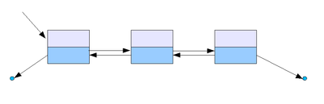

연결 리스트(= 노드가 데이터와 포인터를 가지고 한 줄로 연결되어 있는 방식) 에는 3가지 기본 유형이 있다.

### 1. 단순 연결 리스트 (Singly Linked List)

> 다음 노드에 대한 참조만을 가진 가장 단순한 형태

마지막 노드(= tail)를 찾기위해 O(n)의 시간을 가져야 되기 때문에, 마지막 노드만 가리키는 참조를 따로 가지는 변형된 형태도 있다.

단점으로는 안정적인 자료구조가 아니다.

특정 Head 노드를 참조하는 주소를 잃어버릴 경우,
데이터 전체를 못쓰게 되고, 다음 노드를 참조하는 주소 중 하나가 잘못되면 그 뒤로 있는 자료는 유실된다.

### 2. 이중 연결 리스트 (Doubly Linked List)

> 다음 노드에 대한 참조와 이전 노드 참조를 같이 가리키게 하는 이중 연결 리스트 형태

어느 방향으로든 리스트를 종주할 수 있고, 뒤로 탐색이 빠르다. 대신에 참조해야될 대상이 두 개이기 때문에, 삽입 정렬의 경우 작업량이 더 많고 자료구조의 크기가 약간 더 커진다.

위 단일 연결 리스트보다 손상에 강하다는 장점이 있다.

Head와 Tail노드 포인터(또는 레퍼런스) 를 갖고 있어서 전체 리스트 순회가 되기 때문에 끊어진 체인 복구가 가능하다.

단, 보정 알고리즘이 없을 경우 손상에 더 취약하다. 예를 들어 next 포인트는 갱신 되었지만 prev가 갱신되지 않았다면, prev포인터를 따라가다가 순회가 불가능한 형태의 노드가 발생하게 된다.

### 3. 원형 연결 리스트 (Circular Linked List)

> 마지막 원소가 null 이지 않고, 처음과 끝을 서로 이어주면서 처음 원소를 가르키게 되는 원형 연결 리스트 형태.

Head(처음 노드), Tail(마지막 노드)가 없다.

시작점을 제대로 파악하지 않았을 경우, 리스트를 끊임없이 순회해야하는 무한 루프에 빠질수 있다는 단점이 있다.