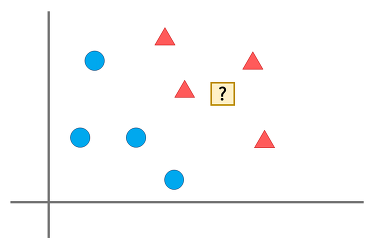

## KNN (K-nearest neighbors)

K개의 가장 가까운 이웃 데이터를 이용하여 분류와 회귀 분석을 할 수 있다. 분류는 그룹으로 나누는 작업을 뜻하고 회귀는 숫자로 된 반응을 예측 (예, 영화 평점)을 뜻 한다. 이런 KNN 알고리즘에는 비교대상의 기준이될 특징을 고르는 것이 가장 중요하다.

<table>
  <thead>
    <tr>
      <td>장점</td>
      <td>단점</td>
    </tr>
  </thead>
  <tbody>
    <tr>
      <td>
        

          - 비모수적 방법으로 어떤 분포든 상관없다 
          - 쉽고 이해하기 직관적이다 
          - 샘플 수가 많을 때 좋은 분류법이다.
        

      </td>
      <td>
        

          - 최적의 K를 선택하기가 어렵다 
          - 데이터가 많을 때 분석속도가 느릴 수 있다. 
          - 특정분포를 가정하지 않기 때문에 샘플 수가 많이 있어야 정확도가 좋다.
        

      </td>
    </tr>
  </tbody>
</table>

### 데이터가 많을 경우 K 는?

특정 프로그램의 유저 데이터가 엄청 많아서 400만 유저 데이터라고 가정을 하고 그 데이터를 기반으로 KNN 알고리즘을 쓴다고 하면, 이웃의 수 K는 보통 제곱근 `sqrt(N)` 명의 이웃을 설정한다. 
너무 적은 수의 이웃을 설정하면 결과가 왜곡될 수 있기 때문이다.

### K는 꼭 홀수?

사진을 보고 짜장면인지 짬뽕인지 판단하는 머신러닝 알고리즘의 이웃값이 4라고 가정하고 특정 사진의 이웃이 하필 짜장2 짬뽕2로 갈린다면 결과치를 받을 수가 없다. 그렇다고 이런 이유로 KNN알고리즘의 이웃값 K를 홀수로만 두면 안된다. 
이유로는, 만약 짜장면 짬뽕 울면 이렇게 3개의 기준을 두는 경우? 등 나뉘는 그룹의 수가 홀수인 경우도 있기때문에 꼭 K를 홀수로 두어야한다는 것은 아니다.

> KNN알고리즘을 사용할때는 분류될 그룹의 종류등을 고려하여 적절한 k값을 설정해주는 것이 중요합니다.

### 올바른 특징 구하기

- 추천하고자하는 기준과 관련이 직접적이어야 한다.
- 특징의 기준이 한쪽으로 편향되어 있지 않아야 한다.

### 코사인 유사도?

벡터의 규모(크기)가 중요하지 않을 때 사용된다.

#### 코사인 유사도 예시 - 1
단어의 포함 여부로 문서의 유사 여부를 판단한다고 할때 ‘science’라는 단어가 2번 보다 1번 문서에 더 많이 포함되어 있다면 1번 문서가 과학 문서라고 추측할 수 있을 것이다. 그러나, 만약 1번 문서가 2번 문서 보다 훨씬 더 길다면 공정하지 않은 비교가 된다. 이때 코사인 유사도는 이 문제를 바로 잡아줄 수 있다.

### 코사인 유사도 예시 - 2
몸무게와 키가 사람의 맞게 일정한 비율로 분포된 그래프에 소의 기준 비율로 분포된 데이터를 넣게되었을때, 분명 KNN 알고리즘 거리를 구하는 방법으로는 각 2그룹의 기준을 정확하게 보기가 어렵다. 230cm, 130kg의 사람 A와 150cm, 40kg 사람 B는 서로의 거리가 멀고 그 거리 사이에 소 데이터(170cm, 100kg)가 있을 수 있다. 비교대상군의 거리를 구하기보다 각도를 구하는 코사인 유사도를 적용하면 비교를 더 정확히 할 수 있다.

|KNN algorithm|Cosine similarity|
|:-:|:-:|
|||

--------

## 출처

- [[Machine Learning] K-최근접 이웃(K-Nearest Neighbor, KNN) #1](https://analysts.tistory.com/5)

- [Tigercow.Door](https://doorbw.tistory.com/175 )

- [Cos similarity](https://velog.io/@crescent702/cos-similarity)