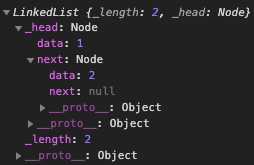

리스트라는 자료구조는 크게 2 가지 구현 방법이 있다.

1. 선형 리스트(Linear List) : 배열을 기반으로 구현된 리스트 (배열 리스트)

2. 연결 리스트(Linked List) : 노드의 연결로 구현된 리스트

## 연결 리스트(Linked list) 란
각 노드가 데이터와 포인터를 가지고 한 줄로 연결되어 있는 방식으로 데이터를 저장하는 자료 구조 이다.

List 라는 자료구조는 데이터를 나란히 저장하며, 중복된 데이터의 저장을 허용하므로 '집합'(중복 허용 X) 과 다르다.

장점으로, 배열에 비해서 데이터를 추가/삽입/삭제가 용이하다. 메모리 할당에 있어서 배열보다 자유롭다. 배열은 연속된 메모리 공간을 할당 받는 대신에, 연결 리스트는 다음 노드를 가르키는 포인터(또는 프로퍼티) 로 연결을 하기때문이다.

단점으로, 순차적으로 탐색하지 않는다면 특정 인덱스 노드에 접근할 수가 없어서 일반적으로 탐색 속도가 떨어진다.

위 같은 단점으로 데이터 검색에 쓰이기 어렵고, 정렬의 경우 O<sub>(n log n)</sub> 시간에 가능하다는 단점이 있다.

> 자료에 접근하는 방식으로 임의 접근 (random access), 순차 접근 (sequentital access)가 있고, 연결 리스트는 순차접근은 가능하지만 임의 접근이 안된다.

## 읽기/삽입/삭제 시간복잡도

|   |배열|리스트|
|:-:|:-:|:-:|
|읽기|O<sub>(1)</sub>|O<sub>(n)</sub>|
|삽입|O<sub>(n)</sub>|O<sub>(1)</sub>|
|삭제|O<sub>(n)</sub>|O<sub>(1)</sub>|

> O<sub>(n)</sub> : 선형 시간<br />
O<sub>(1)</sub> : 고정 시간

## Javascript, 연결 리스트 만들기

```javascript
function Node(data) {
  this.data = data;
  this.next = null;
}

function LinkedList () {
  this._length = 0;
  this._head = null;
}
```

- length 는 연결 리스트에 담긴 노드의 개수를 나타낸다.
- head는 다음 노드의 포인터로, 다음 노드를 참조한다.

### append : linked list에 노드 추가
```javascript
LinkedList.prototype.append = function(data) {
  const node = new Node(data);
  let current;

  if (this._head === null) {
    this._head = node;
  } else {
    current = this._head;

    while(current.next !== null) {
      current = current.next;
    }

    current.next = node;
  }

  this._length ++;
};

var testList = new LinkedList();
testList.append(1);
testList.append(2);
```

head가 비어있을 경우, 새롭게 append 한 데이터 노드를 가르켜 지게 된다.

> head -> node (data: 1)

head가 비어있지 않는 경우 (= 리스트가 비어있지 않는 경우), 리스트의 현재 추가 생성된 node를 current.next 루프로 마지막 지점 null이 되는 지점에서 가리키게 한다.

> head -> node (data: 1) -> node (data: 2) -> null

결과는 아래와 같다.


### removeAt : 특정 인덱스 노드를 삭제

```javascript
LinkedList.prototype.removeAt = function(idx) {
  const isRemovableIndex = (idx > -1 && idx < this._length);
  if (!isRemovableIndex) return null;

  let current = this._head;
  let previous, index = 0;
  if (idx === 0) {
      this._head = current.next;
  } else {
      while (index++ < idx) {
          previous = current;
          current = previous.next;
      }
      previous.next = current.next;
  }

  this._length --;
  current.next = null;
  return current.data;
};

testList.removeAt(100) // null
testList.removeAt(0) // 1
testList.removeAt(0) // 2
```

지우지 못하는 인덱스가 들어온 경우<br/>
(= 인덱스가 -1 보다 크고, length 보다 작지 않은 경우) null을 반환한다.

반대로, 접근 가능한 인덱스일 경우<br/>
`head(index = 0) 를 삭제하는 경우` head에 head가 가르키는 노드의 다음 노드(next)를 넣어준다.

`index > 0 삭제하는 경우` 지우려는 인덱스 노드에 순회로 접근한 뒤 이전노드 next에 지우려는 노드 next를 넣어준다.

위 각 두가지 케이스 진행 후, length를 1 낮추고 지워진 데이터를 반환한다.

### indexOf : 데이터 값을 받아서, 리스트에 해당하는 인덱스를 반환

```javascript
LinkedList.prototype.indexOf = function(data) {
  let current = this._head;
  let index = -1;

  while (current) {
    index ++;
    if (current.data === data) {
      return index;
    }
    current = current.next;
  }

  return -1;
};

var testList = new LinkedList();
testList.append(1);
testList.append(2);
testList.append(3);

testList.indexOf(3099); // -1
testList.indexOf(3); // 2
testList.indexOf(2); // 1
testList.indexOf(1); // 0
```

### remove : 데이터 값으로 노드를 삭제
```javascript
LinkedList.prototype.remove = function(data) {
  const index = this.indexOf(data);
  return this.removeAt(index);
}

var testList = new LinkedList();
testList.append(1);
testList.append(2);

testList.remove(3099); // null
testList.remove(1); // 1

testList._head.data // 2;
```

### insert : 원하는 인덱스에 노드를 추가 삽입
```javascript
LinkedList.prototype.insert = function(idx, data) {
  const insertableIndex = (idx >= 0 && idx <= this._length);
  if (!insertableIndex) return false;

  const node = new Node(data);
  let current = this._head;
  let previous;
  let index = 0;

  if (idx === 0) {
    node.next = current;
    this._head = node;
  } else {
    while (index < idx) {
      index ++;
      previous = current;
      current = current.next;
    }

    node.next = current;
    previous.next = node;
  }

  this._length ++;
  return true;
};


var testList = new LinkedList();
testList.append(1);
testList.append(2);

testList.insert(12, 123); // false;
testList.insert(1, 123); // true;

// 노드 순서: head -> 1 -> 123 -> 2 -> null
```

인덱스가 insert 가능한지 여부 먼저 보고 불가능한 인덱스일 경우 false를 반환.

insert 가능한 인덱스가 들어올 경우, head에 넣는 경우가 아니라면 insert 할 인덱스의 노드를 찾은 뒤 node.next 에는 찾은 인덱스 노드를 그리고 찾은 인덱스 노드의 next 에는 새롭게 넣을 노드를 참조하게 하면 된다.