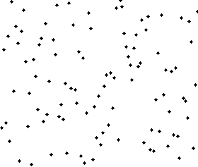

### 병합 정렬이란?

단순하지 않은 정렬 알고리즘 중 제일 단순한 정렬로, 모든 숫자를 다 나눈 다음에 병합하는 방식으로 정렬을 진행.



> Divide and Conquer(분할 정복 기법), 데이터를 "분할을 계속해서 정복한다" 는 방식으로, 특정 데이터를 나누고 또 나누어서 가장 간단한 기본 단계를 찾고, 주어진 문제를 그러한 기본단계가 될 때까지 만드는 법을 뜻한다.

#### 예시 설명

[10, -1, 2, 5, 0, 6, 4, -5] 의 정렬되지 않은 배열을 두고, `분할 정복 기법` 을 적용하여 최소단위 배열로 분할한다. [10, -1, 2, 5], [0, 6, 4, -5] 로 나뉘고 또 다시
[10, -1], [2, 5] 그리고 [0, 6], [4, -5]로 나뉜다. 반복하여, 최소단위 배열인
[10], [-1] ... 과 같이 나누게 되면 이제는 다시 합치는 작업을 통해 정렬을 한다.
[-1, 10], [2, 5], [0, 6], [-5, 4] 에서 또다시 합치면서 정렬, [-1, 2, 5, 10], [-5, 0 ,4, 6] 최종적으로는 [-5, -1, 0, 2, 4, 5, 6, 10] 을 반환한다.

#### Javascript 코드 예시

```javascript
// 병합 정렬 재귀
function mergeSort (unsortedArray) {
  // 최소단위 배열 (비어있거나, 요소가 한개 일 경우)는 return
  if (unsortedArray.length <= 1) {
    return unsortedArray;
  }
  // 비정렬된 배열의 중간 Index 확인
  const middle = Math.floor(unsortedArray.length / 2);

  // 위 중앙 인덱스를 기준으로 나누기
  const left = unsortedArray.slice(0, middle);
  const right = unsortedArray.slice(middle);

  // 나누어진 배열을 재귀로 최소단위 배열로 만들고, 나누어진 왼쪽, 오른쪽 배열을 재병합
  return merge(
    mergeSort(left), mergeSort(right)
  );
}
```

위 처럼 배열을 나누고 병합하는 재귀 형태의 코드가 있다면, 이제 `merge` 병합 & 정렬 역할을 담당하는 코드를 구현하면 아래와 같다.

```javascript
// 왼쪽, 오른쪽 두 배열의 병합
function merge (left, right) {
  let resultArray = [], leftIndex = 0, rightIndex = 0;

  // 왼쪽, 오른쪽 배열을 서로 순회 & 비교를 통해서 resultArray에 요소를 정렬해서 넣는다.
  while (leftIndex < left.length && rightIndex < right.length) {
    if (left[leftIndex] < right[rightIndex]) {
      resultArray.push(left[leftIndex]);
      leftIndex++; // 왼쪽 배열 포인터 index 이동
    } else {
      resultArray.push(right[rightIndex]);
      rightIndex++; // 오른쪽 배열 포인터 index 이동
    }
  }

  // 왼쪽 또른 오른쪽 배열 중 하나의 원소가 남아있기 때문에 concat을 이용해서 최종 배열과 합쳐서 반환시켜야한다.
  return resultArray
  .concat(left.slice(leftIndex))
  .concat(right.slice(rightIndex));
}
```

```javascript
mergeSort([2, 0, -3949, 21, 3000, -28, -1, 203, 39, 4, 444, 900000, -31]);
// 결과: [-3949, -31, -28, -1, 0, 2, 4, 21, 39, 203, 444, 3000, 900000]
```

#### 병합정렬, 장단점 정리

- 단점
  - 위 예시코드 `merge` 병합과정을 보면 `let resultArray = []` 의 코드를 볼 수 있듯이, 임시 배열이 필요하기 때문에 병합정렬은 제자리 정렬이 아니다.
  - 최소단위로 분할한 회수만큼 다시 병합을 하는 과정을 필요로 하기 때문에, 배열의 크기가 큰 경우에는 이동 횟수가 많으므로 매우 큰 시간적 낭비를 초래한다.

- 장점
  - 데이터의 분포에 영향을 덜 받는다. 즉, 입력 데이터가 무엇이든 간에 정렬되는 시간은 동일하므로 (O(n log<sub>2</sub> n)으로 동일) 안정적인 정렬 방법이다.
  - 배열이 아닌, 연결 리스트(Linked List)로 구성하면, 링크 인덱스 변경을 통해 데이터 이동이 이루어지기 때문에 제자리 정렬 구현이 가능하다.
  - 위 장점을 이용하면, 큰 데이터를 가진 경우에도 합병 정렬이 퀵 정렬을 포함한 다른 어떤 정렬 보다 더 효율적이다.

-----

### 출처
https://medium.com/javascript-in-plain-english/javascript-merge-sort-3205891ac060

https://gmlwjd9405.github.io/2018/05/08/algorithm-merge-sort.html