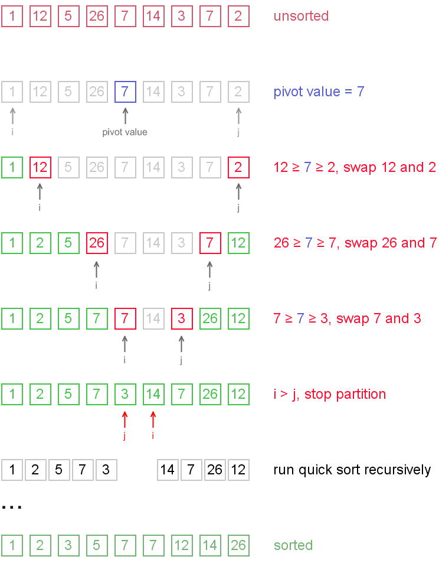
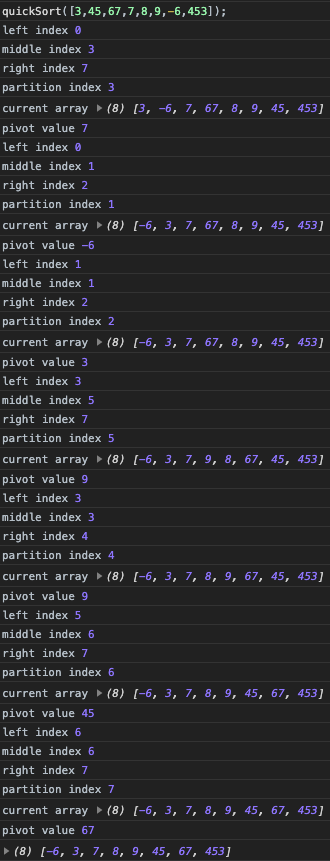

## 퀵 정렬이란?

퀵 정렬은 가장 빠른 정렬 알고리즘 중 하나로, Divide and Conquer 방식을 사용한 알고리즘 이다.

> Divide and Conquer(분할 정복 기법), 데이터를 "분할을 계속해서 정복한다" 는 방식으로, 특정 데이터를 나누고 또 나누어서 가장 간단한 기본 단계를 찾고, 주어진 문제를 그러한 기본단계가 될 때까지 만드는 법을 뜻한다.

방식으로 제자리 정렬 또는 제자리 정렬이 아닌 두 가지 방식이 있다.

`제자리 정렬 방식이아닌 퀵 정렬 방식`으로, 기준('pivot')이 될 값을 정하고 그 기준을 토대로 왼쪽, 오른쪽으로 나누어서 가장 간단한 배열(요소가 하나이거나, 없는 배열)이 될 때까지 배열을 나누면서 정렬하고 마지막에 해당 배열을 합치면서 정렬하는 방식을이거나,

`제자리 정렬 방식인 퀵 정렬 방식`으로, 기준('pivot')을 설정하고 처음 값(가장 왼쪽 값)과 마지막 값(가장 오른쪽 값)으로 시작한다.
왼쪽에서는 pivot 보다 큰 값이 나타날 때까지 오른쪽으로 이동하고, 오른쪽에서는 pibot 보다 작은 값이 나올때 까지 왼쪽으로 이동한다. pivot 보다 큰 왼쪽 값과 pivot 보다 작은 오른쪽 값을 서로 교환한다. 해당 과정을 반복하고 왼쪽의 인덱스가 오른쪽의 인덱스보다 커지면 해당 시점을 기준으로 두 배열로 가르고 다시 재귀 호출을 하여 정렬한다.

> `제자리 정렬` 이란 ?<br/>
부가적인 메모리 추가가 없이, 데이터가 저장된 공간 내에서 정렬을 한다.

## Quick sort, 제자리 정렬이 아닌 방식 : 부가적 메모리 공간이 필요

```javascript
function quickSort(arr) {
  if (arr.length < 2) {
      return arr;
  }

  const pivot = [arr[0]];
  const left = [];
  const right = [];

  for (let i = 1; i < arr.length; i++) {
      // pivot 을 기준으로 왼쪽에 작은 수를 넣는다
      if (arr[i] < pivot[0]) {
          left.push(arr[i]);
      // pivot 을 기준으로 오른쪽에 큰 수를 넣는다
      } else if (arr[i] > pivot[0]) {
          right.push(arr[i]);
      // pivot 을 기준으로 같은 수를 넣는다.
      } else {
        pivot.push(arr[i]);
      }
  }
  // 나누어진 left, right 배열을 재귀로 quick sort를 해서 합친다.
  return quickSort(left).concat(pivot, quickSort(right));
}
quickSort([5,1,1,2,0,0]);

// [0,0,1,1,2,5];
```

위 같은 방법은 이해하기에 쉽고 구현 또한 쉽지만, `제자리 정렬` 방식이 아니므로 메모리 공간 낭비가 심하기 때문에, `제자리 정렬` 방식이 더 많이 사용된다.

## Quick sort, 제자리 정렬 방식 : 부가적 메모리 공간 불필요

<div style="background:#fff; border: 1px solid #fff; border-radius: 5px;">
  
</div>

```javascript

function divide(arr, leftIndex, rightIndex, pivot) {
  // 왼쪽 인덱스가 오른쪽 인덱스와 같거나 적을때 까지
  while (leftIndex <= rightIndex) {
    // pivot 보다 작은 값을 찾을때까지 왼쪽에서 오른쪽으로 이동
    while (arr[leftIndex] < pivot) {
      leftIndex++;
    }
    // pivot 보다 큰 값을 찾을때까지 오른쪽에서 왼쪽으로 이동
    while (arr[rightIndex] > pivot) {
      rightIndex--;
    }
    // 왼쪽값과 오른쪽값을 교체하고, 다음 왼쪽 숫자 + 오른쪽 숫자 인덱싱
    if (leftIndex <= rightIndex) {
      let swap = arr[leftIndex];
      arr[leftIndex] = arr[rightIndex];
      arr[rightIndex] = swap;
      leftIndex++;
      rightIndex--;
    }
  }
  return leftIndex;
}

function quickSort(arr, leftIndex = 0, rightIndex = arr.length - 1) {
  // 왼쪽 값 인덱스가 오른쪽 값의 인덱스를 같거나 크게되면 종료
  if (leftIndex >= rightIndex) {
    return;
  }

  const mid = Math.floor((leftIndex + rightIndex) / 2);
  const pivot = arr[mid];
  // 다음 분기가 될 인덱스 값
  const partition = divide(arr, leftIndex, rightIndex, pivot);

  // partiyion 을 기준으로 왼쪽 오른쪽 나누고 분기하여 재귀 quick sort
  quickSort(arr, leftIndex, partition - 1);
  quickSort(arr, partition, rightIndex);
  
  return arr;
}
```

로그는 아래와 같다.



## 시간복잡도

|||
|-|-|
|최악의 경우 O<sub>(n<sup>2</sup>)</sub>| 최선의 경우 O<sub>(n log<sub>2</sub> n)</sub>|

> 최악의 경우<br/>
pivot이 가장 작은 수이거나 가장 큰 수일 경우에는 두 배열로 나누더라도 한쪽은 항상 비어있고 한쪽은 꽉 차있으므로 최악의 경우에 해당한다.

성능은 최악의 경우 O<sub>(n<sup>2</sup>)</sub>이지만 최악의 경우를 제외하면 O<sub>(n log<sub>2</sub> n)</sub> 시간복잡도로, 최악의경우가 나오는 경우는 아주 희박하기 때문에 O<sub>(n log<sub>2</sub> n)</sub>으로 취급하고 같은 O<sub>(n log<sub>2</sub> n)</sub>이지만 합병 정렬보다는 두 배 빠르기 때문에 더 자주 쓰이는 알고리즘 기법이다.

---

## 출처

https://www.guru99.com/quicksort-in-javascript.html

https://im-developer.tistory.com/135