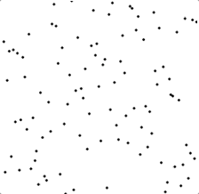

기본적인 정렬 알고리즘 3가지.

1. Selection Sort
2. Insertion Sort
3. Bubble Sort

### 선택 정렬이란?

- 주어진 리스트 중에 최소값을 찾는다.
- 그 값을 맨 앞에 위치한 값과 교체한다.
- 맨 처음 위치를 뺀 나머지 리스트를 같은 방법으로 교체한다.

| | |
|-|-|
|선택 정렬은 알고리즘이 단순하고, 사용할 수 있는 메모리가 제한적인 경우에 사용시 성능 상의 이점이 있다.<br/>시간복잡도, O<sub>(n * 1/2 * n)</sub> = O(n<sup>2</sup>)||

#### 순서 설명

각 루프 마다, 최소값을 찾는다.
찾은 값을 배열 맨 앞에 위치한 값과 교환을 한다.
다음 루프 때는 맨 앞에 위치한 값을 제외하고 순회하면서 최소값을 찾는다.
그 값을 맨 앞의 위치 바로 다음 위치와 교체한다.
해당 과정을 반복한다.

#### 장점

선택정렬은 제자리 정렬 알고리즘으로, 메모리가 절약이 되기 때문에, 자료를 정렬할 때 추가적인 메모리 공간이 필요하지 않다.

> `제자리 정렬` 이란 ?<br/>
부가적인 메모리 추가가 없이, 데이터가 저장된 공간 내에서 정렬을 한다.

다른 장점으로는, 알고리즘이 이해하기가 쉽고 구현 또한 쉽다.

#### 단점

Big O 로 나타내면 최악, 최선의 케이스 모두 O<sub>(n<sup>2</sup>)</sub>의 시간이 걸린다.
= 성능이 매우 떨어지는 정렬

#### 자바스크립트 구현

```javascript
function selectionSort(arr) {
  for (let i=0; i < arr.length; i++) {
    // 최소값 인덱스를 첫번째 자리로 가정하고 시작한다.
    let minIdx = i;
    // 첫 인덱스를 제외한 나머지 인덱스와 비교를 하여서 최소값을 찾는다.
    for (let j=i; j < arr.length; j++) {
      if (arr[j] < arr[minIdx]) { 
        minIdx = j;
      }
    }

    // 현재 순회값과 비교하여서 더 작을 경우, 교체를 한다.
    if (arr[i] > arr[minIdx]) {
      let swap = arr[i];
      arr[i] = arr[minIdx];
      arr[minIdx] = swap;
    }
  }

  return arr;
}

selectionSort([5,6,9,1,3,0]);
// [0,1,3,5,6,9];
```

> 만약 `selectionSort([1,2,3,4]);` 처럼 값을 넣었을 경우에도, 처음 순회때 이미 최소값 정렬이 되었지만, 계속 순회를해서 최소값을 찾는 과정을 하기 때문에 비효율적인 정렬인 것을 볼 수 있다.

또 다른 단점으로는,
값이 중복되었을 경우, 위치가 바뀔 수 있다.
예로들어, `selectionSort([3,3,1]);` 값을 넣는다고 하면,
같은 값이지만 첫 인덱스의 3과 두번째 인덱스의 3의 순서가 바뀔 수 있다. `1, 3(변경 전 두번째 인덱스 3), 3(변경 전 첫번째 인덱스 3)`

### 삽입 정렬이란?

순회시 매 순서마다 해당 값(원소)를 삽입할 수 있는 위치를 찾아서 해당 위치에 넣는 정렬을 말한다.

#### 순서 설명
두번째 요소를 시작으로 왼쪽 요소들과 비교한다.
요소 크기를 비교하고 자리가 그대로 유지되어도 된다면 다음 요소로 넘어가고, 왼쪽 요소와 비교하여서 삽입될 위치가 있다면 해당 위치로 들어가고 다음 요소로 넘어간다.
해당 과정을 반복한다.

|||
|-|-|
|이미 정렬이 다 되어있는 경우, O<sub>(n)</sub>| 정렬이 하나도 안되어있는 경우, O<sub>(n<sup>2</sup>)</sub>|

#### 장점

선택정렬과 마찬가지로 제자리 정렬 알고리즘으로, 메모리가 절약이 되기 때문에, 자료를 정렬할 때 추가적인 메모리 공간이 필요하지 않다. 또한 알고리즘이 이해하기가 쉽고 구현 또한 쉽다.

이미 정렬된 데이터는 O<sub>(n)</sub> 의 시간복잡도를 가지기 때문에 순회만 하면 되므로, 정렬이 되어있는지 여부를 테스트하기에 용이하다.

#### 단점

배열의 원소가 많으면 많을수록 (자료구조가 클 수록) 성능이 매우 떨어진다.

#### 자바스크립트 구현

```javascript
function insertionSort (arr) {
  // 첫 시작은 왼쪽 요소와 비교를 위해 2번째 위치부터 시작
  for (let idx = 1; idx < arr.length; idx ++) {
    let cur = arr[idx];
    let left = idx - 1;

    // 왼쪽 요소 순회하면서 현재 순회 요소와 값 비교하면서 왼쪽 요소를 하나씩 줄인다. (이미 정렬이 되어있는경우 해당 while문 순회를 안하므로 O(n) 시간복잡도 성립)
    while (left >= 0 && arr[left] > cur) {
      arr[left + 1] = arr[left];
      left --;
    }
    // 맨 앞의 요소에 현재요소를 삽입.
    arr[left + 1] = cur;
  }

  return arr;
}

insertionSort([9,8,3,5,6,1]);
// [1,3,5,6,8,9]
```

### 버블 정렬이란?

개념은 선택정렬과 비슷하다, 버블 정렬은 두개씩 묶어서 비교를 하고
큰 쪽을 오른쪽에 가도록 자리변경을 하면서 순회한다.

#### 순서 설명
첫번째와 두번째 값을 비교를 하는 것을 시작으로 큰 값을 오른쪽에 배치한다.
다음 두번째와 세번째 값을 비교하고 오른쪽으로 두고, 값이 정렬이되어있다면 그대로 두고 다음 값으로 넘어간다. 해당 과정을 반복한다. 그래서 이미 정렬된 값의 경우 O<sub>(n)</sub> 의 시간복잡도를 나타낸다.


> 순회 1: [`5,3`,1,4,6] → [3,`5,1`,4,6] → [3,1,`5,4`,6] → [3,1,4,`5,6`] → [3,1,4,5,6]<br/>
순회 2: [`3,1`,4,5,6] → [1,`3,4`,5,6] → [1,3,`4,5`,6] → [1,3,4,5,6]<br/>
순회 3: [`1,3`,4,5,6] → [1,`3,4`,5,6] → [1,3,4,5,6]


|||
|-|-|
|이미 정렬이 다 되어있는 경우, O<sub>(n)</sub>| 정렬이 하나도 안되어있는 경우, O<sub>(n<sup>2</sup>)</sub>|

#### 장점

위 2정렬과 마찬가지로 제자리 정렬 알고리즘으로, 메모리가 절약이 되기 때문에, 자료를 정렬할 때 추가적인 메모리 공간이 필요하지 않다. 또한 알고리즘이 이해하기가 쉽고 구현 또한 쉽다.

삽입정렬 처럼 정렬된 데이터는 O<sub>(n)</sub> 의 시간복잡도를 가지기 때문에 순회만 하면 되므로, 정렬이 되어있는지 여부를 테스트하기에 용이하다.

#### 단점

배열의 원소가 많으면 많을수록 (자료구조가 클 수록) 성능이 매우 떨어진다.

#### 자바스크립트 구현

```javascript
function bubbleSort(arr) {
  for (let i = 0; i < length; i++) {
    let swap;
    // 내부에서 arr[j] arr[j + 1] 을 비교할 예정으로 arr -1 -i까지 순회를 한다.
    // 배열의 마지막 값은 순회에 이미 포함이 되므로 -1 하고
    // 한번의 순회로 하나의 값이 정렬되므로 i 만큼 빼준다.
    for (let j = 0; j < length -1 -i; j++) {
      if (arr[j] > arr[j + 1]) {
        swap = arr[j];
        arr[j] = arr[j + 1];
        arr[j + 1] = swap;
      }
    }
    
    // swap 변수가 undefiend 일 경우는 정렬이 완료되었으므로, for문을 종료
    if (!swap) {
      break;
    }
  }
  return arr;
};
```