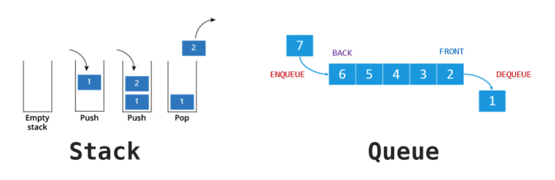

### 자료구조 스택 그리고 큐



> 스택은 나중에 넣은 데이터가 먼저 나오는 형태이고, 큐는 먼저 넣은 데이터가 먼저 나오는 형태이다.

### 스택 (Stack)

`LIFO (Last In First Out), 후입선출` 이라고 불리는 자료구조

- 데이터를 집어넣을 수 있는 선형 자료구조이다.
- 삽입(Push) 와, 삭제(Pop) 이라는 두가지 함수를 사용한다.
- TOP 이라는 스택 포인터를 가지고 있다. (Stack으로 할당된 기억공간에 제일 마지막 삽입된 자료가 기억된 위치를 가르키는 요소)

> 자료가 없을 때 Pop을 하면 Error로 "Stack Underflow" 가 발생하고, 반대로 자료의 크기가 스택의 크기를 넘게 데이터 삽입 Push를 하면, "Stack Overflow" Error가 발생한다.<br />
재귀함수를 호출할 때 제한된 스택을 넘어설 경우, "Stack Overflow" 에러를 볼 수 있다.

#### JavaScript 구현

```javascript
class Stack {
  constructor() {
    this.data = [];
  }

  push(item) {
    this.data.push(item);
  }

  pop(item) {
    return this.data.pop();
  }
  // 마지막에 넣은 데이터를 확인하는 peek이라는 작업도 있다.
  peek() {
    return this.data[this.data.length - 1];
  }
  // 아이템이 스택에 존재하는지 확인.
  contains(item) {
    return this.data.indexOf(item) !== -1;
  }
  // 스택의 총 개수를 반환
  size() {
    return this.data.length;
  }
}

const test = new Stack();
test.push(1);
test.push(2);
test.push(3);

test.size(); // 3
test.pop(); // 3
test.peek(); // 2
test.contains(444); // false
```

### 큐 (Queue)

`FIFO (First Input First Out), 선입선출` 이라고 불리는 자료구조

- 데이터를 집어넣을 수 있는 선형 자료구조이다.
- 데이터를 집어넣는 `enqueue`, 추출하는 `dequeue` 함수로 이루어져 있다.
- 시작과 끝을 표시하는 두 개의 포인터를 가진다.
  - 가장 먼저 삽입된 자료의 위치를 가르키고, 삭제작업에 사용되는 프런트(Front) 포인터
  - 가장 마지막에 삽입된 자료의 위치를 가르키고, 삽입작업에 사용되는 리어(Rear) 포인터
- 자바스크립트 엔진 내, 비동기 함수 실행시 콜백들이 대기열로 들어오는 `Task queue`가 대표적이다.

#### JavaScript 구현

```javascript
class Queue {
  constructor() {
    this.data = [];
  }

  enqueue(item) {
    this.data.push(item);
  }

  dequeue() {
    return this.data.shift();
  }

  // 아이템이 스택에 존재하는지 확인.
  contains(item) {
    return this.data.indexOf(item) !== -1;
  }
  // 스택의 총 개수를 반환
  size() {
    return this.data.length;
  }
}

const test = new Queue();
test.enqueue(1);
test.enqueue(2);
test.enqueue(3);

test.size(); // 3
test.dequeue(); // 1
test.dequeue(); // 2

test.contains(1); // false
```