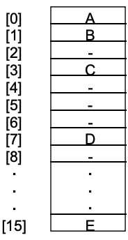

> 선형구조인 큐, 스택과 다르게 트리는 비선형 구조이고 계층적(망) 으로 구성 되어있다. 또한, 자료를 저장하고 꺼내는 것에 초점이 맞춰진 선형구조와 다르게 표현에 초점이 맞춰져 있다. 예시로 컴퓨터 디렉토리 구조 또는 조직도 등이 있다.

### 트리란?
어떤 노드들의 집합으로 노드들은 서로 다른 자식을 가지며 이때 각 노드는 재사용 되지 않는 구조이다.

#### 트리의 특징
- 트리는 하나의 루트 노드를 갖는다.
- 루트 노드는 0개 이상의 자식 노드를 갖고 있다.
- 그 자식 노드 또한 0개 이상의 자식 노드를 갖고 있고, 이는 반복적으로 정의된다.

### 트리 관련 용어

- 루트 노드(Root node): 부모가 없는 최상단 노드, 트리는 단 하나의 루트 노드만을 가진다.
- 단말 노드(Leaf node): 자식이 없는 노드 '말단 노드' 또는 '잎 노드' 라고 부른다.
- 내부 노드(internal node): 단말 노드가 아닌 노드
- 간선(edge): 노드를 연결하는 선 (link, branch 라는 명칭도 있다.)
- 형제 노드(sibling): 같은 부모를 가지는 노드
- 서브 트리(Sub tree): 큰 트리에 속하는 작은 트리
- 노드 크기(size): 자신을 포함한 모든 자손 노드의 개수
- 노드 깊이(depth): 루트에서 어떤 노드에 도달하기 위해 거쳐야 하는 간선(edge)의 수
- 노드 레벨(level): 트리의 특정 깊이를 가지는 노드의 집합
- 노드 차수(degree): 하위 트리개수 / 간선 수 = 각 노드가 지닌 가지의 수
- 트리 차수(degree of tree): 트리의 최대 차수
- 트리 높이(height): 루트 노드에서 가장 깊숙히 있는 노드의 깊이

### 트리의 종류
"Binary Tree" 그리고 "Non-Binary Tree" 크게 두가지 종류로 나눌수 있다.

#### 이진트리, Binary Tree ?
자식 노드의 수가 2개 이하인 것을 이진 트리(Binary Tree)라고 한다.

 - 노드가 없는 트리도 이진트리가 된다.
 - 자식 노드에 순서가 있다.
 - 이진트리의 최대 레벨이 n인 경우 트리의 최대 노드의 개수는 2n - 1 이다.
   - 레벨 1의 최대 노드 개수 = 1
   - 레벨 2의 최대 노드 개수 = 2
 - 이진 트리의 맆 노드의 개수 n0 와 차수가 1인 노드의 개수 n1, 차수가 2인 노드의 개수 n2에 관한 다음의 등식이 성립한다.
   - n0 = n2 + 1
   - n = n2 + n1 + n0
   - n = 2 * n2 + 1 * n1 + 0 * n0 + 1

#### 이진트리에 속하는 다양한 트리 종류

Skewed, 스큐 이진 트리
트리의 노드가 왼쪽이나 오른쪽으로 한쪽으로만 노드가 있는 트리

Full, 전 이진 트리 : Full Binary Tree
모든 노드가 0 개 또는 2개의 자식 노드를 갖는 트리

Complete, 완전 이진 트리 : Complete Binary Tree
마지막 레벨을 제외한 모든 레벨의 노드가 완전히 채워져 있으며 마지막 레벨의 노드들은 가능한 한 왼쪽부터 채워져 있는 구조를 가진다. (높이가 h인 경우, 노드의 수는 2h 이상이고, 2(h+1) 미만이다.)

Perfect, 포화 이진 트리 : Perfect Binary Tree
트리의 깊이가 k, 2k - 1 노드를 가진 이진 트리로 노드가 꽉 차있는 이진 트리이다. (높이가 h인 경우, 2(h+1) - 1이 노드의 수가 된다.)

> 포화 이진 트리는 완전 이진 트리이면서 전 이진 트리인 경우 이다.

트리를 구현할 때에는 대체적으로 연결리스트를 이용하는데, 이유로는 아래와 같다.
- 배열의 경우 이용하지않는 저장공간이 많이 생길 수 있다. (스큐 이진트리)의 경우 [A,B,-,C,-,-,-,D,-,....]
- 트리의 최대 깊이를 대비해서 많은 메모리를 확보하고, 트리가 예상 메모리 공간보다 커질 경우, 프로그램 수행을 종료해야 한다.

|스큐 이진트리|배열|연결리스트|
|:-:|:-:|:-:|
||||

하지만 단점으로는 배열보다는 저장이 불편하고 트리 전체를 탐색하는 알고리즘이 복잡해진다.

### Non-Binary Tree ?
위 이진트리와 다르게 자식 노드가 3개 이상이 될 수 있는 트리를 말한다.

#### Trie, 접두사 트리

가장 대표적인 트리는 트라이(Trie), 접두사 트리로 문자열에 특화된 자료구조로 원하는 단어를 찾는 작업을 O(n)에 해결할 수 있는 자료구조이다.

어떤 단어를 찾을 때 문자열의 길이만큼 시간이 들고, 시간복잡도는 O(n) 이 된다.

> 치명적 단점으로는 공간 복잡도가 크다. 알파벳으로 모든 포인터를 설정해야 하므로, a-z 총 26개의 포인터를 가져야하기 때문이다.

-----

### 출처

https://gmlwjd9405.github.io/2018/08/12/data-structure-tree.html

http://dblab.duksung.ac.kr/ds/pdf/Chap08.pdf