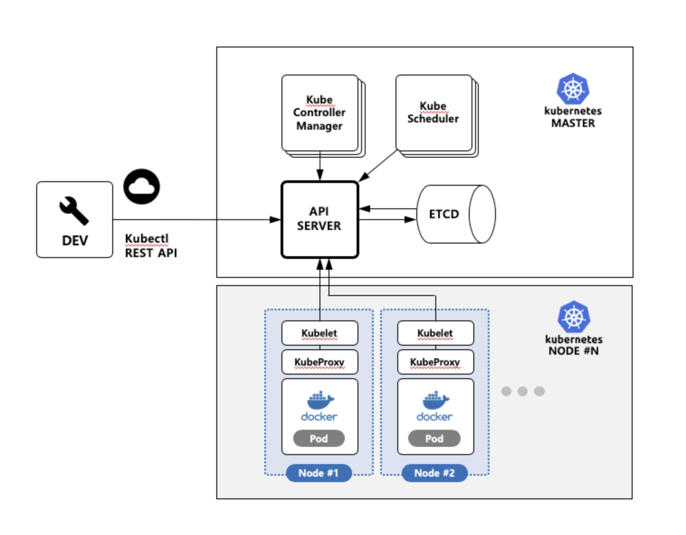

> "K8S" 쿠버네티스는 컨테이너화된 애플리케이션을 효율적으로 배포하고 운영하기 위해 설계된 오픈 소스 플랫폼이다.

## 쿠버네티스 기능

- 배포 계획에 맞춰 애플리케이션을 신속하게 배포할 수 있다.
  - 컨테이너 개수, CPU 사용률, 메모리 사용량을 설정 가능
  - 저장 공간, 네트워크 접근 제어, 로드밸런싱 기능 설정 가능
- 가동 중인 애플리케이션을 스케일 업/다운할 수 있다.
  - 요청이 많을 때는 컨테이너 수를 늘려서 처리 능력을 높임
  - 요청이 적을 때는 컨테이너 수를 줄여서 자원 점유율이나 요금을 줄임
- 새로운 버전의 애플리케이션을 무정지로 업그레이드 가능
- 하드웨어 가동률을 높여 자원 낭비를 줄인다.
- 다양한 환경에서 쿠버네티스 사용 가능
  - 퍼블릭 클라우드: 고객들 간에 공유, 가격 저렴, 신속한 운영
  - 프라이빗 클라우드: 독점적 사용, 보안이 높음
  - 멀티 클라우드: 여러 퍼블릭 클라우드를 함께 사용
  - 하이브리드 클라우드: 온프레미스와 퍼블릭 클라우드를 함께 사용
  - 온프레미스: 자사 설비를 이용해 애플리케이션에 특화된 운영
- 계쇡되는 변화를 전제로 설계된 높은 유연성과 확장성
  - 마이크로 서비스화된 애플리케이션에 최적화된 실행 환경
  - 느슨한 결합에 의한 유연성, 교체 용이성
  - 다양한 스펙의 서버가 혼재하는 클러스터 구성에 사용 가능
  - 서버의 정지, 추가, 제거가 용이
  - 저장소나 로드밸런서의 동적 프로비저닝
  - 퍼블릭 클라우드 API와 연동한 쿠버네티스 조작
- 고가용성과 성능 관리
  - 서버 정지 시 애플리케이션 재배포 자동화
  - 애플리케이션의 이상 종료 시 자동 재기동
  - 필요한 인스턴스의 개수를 유지
  - 높은 부하에서 자동 스케일

## 쿠버네티스로 해결되는 부분

- 애플리케이션의 빈번한 출시
  - 많은 아이디어를 애플리케이션에 시험해보고 실패/성공을 빠르게 롤아웃과 롤백 기능을 통해 가능하게한다.
  - 정식 운영 중인 서비스의 애플리케이션 컨테이너를 무정지로 교체할 수 있게 해준다. 롤아웃 취소, 롤백하는 것도 가능
- 무정지 서비스
  - K8s 클러스터 내에 지정한 수만큼 컨테이너가 돌도록 관리해 준다.
- 초기 배용을 낮추고 비지니스 상황에 맞게 규모를 조정
- 쿠버네티스와 외부 서비스와의 연동
- 개발 환경과 운영 환경의 분리
- 온프레미스와 클라우드 위에 구축
- 애플리케이션 중심의 오케스트레이션
  - 개발자가 YAML 파일을 작성해서 쿠버네티스에 제출하면 로드밸런서, 저장소, 네트워크, 런타임 등의 환경이 구성된다.
- 특정 기업에 종속되지 않는 기술
- 서버들의 가동률 높이기

## 구조

`출처: http://wiki.webnori.com/display/kubernetes/Architecture`

> 쿠버네티스의 아키텍처는 마스터와 노드로 구성되며, 마스터가 노드를 제어하고 노드에서 컨테이너가 돌아간다.

### 마스터(Master) 와 노드(Node) 

쿠버네티스는 크게 마스터와 노드 두 개로 분리된다.

- 마스터는 쿠버네티스의 설정 환경을 저장하고 전체 클러스터를 관리
- 노드는 Pod 나 컨테이너 처럼 쿠버네티스 위에서 동작하는 워크로드를 호스팅

`마스터에서도 컨테이너가 자동 분배되고 그에 따른 Pod 가용성이 실행이 될 수 있다.`

### 마스터 (Master)
쿠버네티스 클러스터 전체를 관리하는 시스템으로 크게는 API 서버, 스케줄링, 콘트롤러매니저, ETCD 로 구성이 되어 있다. 여러개의 클러스터 안의 노드의 리로스 사용 상황을 확인하고 컨테이너를 가동시킬 노드를 자동으로 선택하고 Etcd 분산 키 밸류 스토어(KVS) 를 이용하여 클러스터의 구성정보를 관리한다.

- 마스터/노드를 포함하여 Cluster 전체를 관리하는 주체
- 노드글로벌 이벤트를 감지/탐지 하고 응답하는등 오케스트레이션의 의사결정을 수행
- 인스턴스를 1대 이상으로 구성할 수 있고 일반적인 운영 환경에서는 단일 마스터가 아닌 이중화 또는 삼중화 형태로 구성할 수 있다
- Kube API Server, Controller Manager, Scheduler, etcd 등 여러 모듈로 구성
- Etcd 에는 클러스터의 모든 설정 정보가 포함되어 있다

#### API Server
클러스터 리소스 관리의 모든 명령과 통신을 자체 REST API 를 통해서 하는데, 그 중심이되는 서버가 API 서버이다.
모든 기능들을 REST API로 제공하고 그에 대한 명령을 처리한다.
각 컴포너트로부터 정보를 받아서 ETCD (데이터스토어) 에 저장하고 액세스 한다.
또한 API Server 은 원격으로 액세스 하기 위하여 인증 및 인가 기능을 제어 한다.

#### 데이터스토어 (ETCD)
API 서버가 명령을 주고 받을때, 클러스터의 데이타 베이스 역할이 되는 서버로 설정값이나 클러스터의 상태를 저장하는 서버이다.
데이터를 키 벨류 형태로 관리하고 있으며, API Server 가 Pod 를 배치할때 Etcd 를 참조하여 배치가 된다.
Etcd 에는 선언적 설정정보가 저장되고, 매니페스트 정보가 저장되며 관리된다.

#### 스케쥴러 (Scheduler)
스케쥴러는 Pod,서비스등 각 리소스들을 적절한 노드에 할당하는 역할을 한다. 즉 node 에 할당되지 않는 Pod 은 클러스터의 상태를 헬스체크 한 후, 리소스 가 비어있는 영역에 노드를 찾아 Pod 를 실행시키는 역할을 한다.

#### 컨트롤러 매니져 (Controller Manager)
컨트롤러 매니저는 컨트롤러(Replica controller, Service controller, Volume Controller, 노드controller 등)를 생성하고 이를 각 노드에 배포하며 관리한다. 클러스터의 상태를 실시간으로 감시하고 있으며, 각 Pod 의 상태를 유지하는 컴포너트이다.

### 노드 (Node)
컨테이너 애플리케이션이 작동하는 서버로서 마스터API 에 의하여 노드로 명령어를 받고 실제 워크로드를 생성하여 서비스가 실행된다. 노드에는 Kubelet, Kube-proxy, cAdvisor 그리고 컨테이너(Docker) 런타임이 배포된다. Kubernetes 의 기본 컨테이너 런타임은 Docker 이지만, rkt 등 다른 런타임을 사용할수 도 있다. 노드를 여러대 구성하여 하나의 클러스터로 구성하며, 여러대로 구성하게 되면 그 개수에 따라 서비스 가용성이 향상 된다. 

#### Kubelet
노드에 배포되는 에이전트로, 마스터의 API 서버와 통신을 하며, 노드가 수행해야 할 명령을 받아서 수행하고, 반대로 노드의 상태등을 마스터로 상태를 전달하는 역할을 한다. Pod 의 매니페스트 파일에 따라 컨테이너를 실행하거나 중지 또는 마운트의 기능을 가지고 있다. 노드의 상태를 정기적으로 헬스체크 하고 있는 기능을 가지고 있고 헬스체크의 데이터를 정기적으로 API Server 에게 전송한다.

#### Kube-proxy
노드로 들어오는 네트워크 트래픽을 적절하게 컨테이너로 라우팅하며, 로드밸런싱등 노드로 들어오고 나가는 네트워크 트래픽을 프록시하고, 전반적으로 노드와 마스터간의 다양한 중계 및 네트워크 통신을 관리한다.

#### Container Runtime
Pod 를 통해서 배포된 컨테이너를 실행하는 컨테이너 런타임 역할을 한다. 컨테이너 런타임은 보통 Docker 컨테이너를 기본적으로 사용하고 있으며, Docker 이외에도 rkt (보안이 강화된 컨테이너), Hyper container 등 다양한 런타임등을 사용할 수 있다.

#### cAdvisor
cAdvisor 는 각 노드에서 기동되는 모니터링 에이전트로, 노드내 에서 가동되는 컨테이너들의 상태와 성능등의 정보를 수집하여, 마스터의 API Server 서버로 전달한다.  전송된 데이터들은 주로 모니터링을 위해서 사용된다.

-----

참고서적 - 15단계로 배우는 도커와 쿠버네티스 
[참고 블로그글 - Webnori 위키](http://wiki.webnori.com/display/kubernetes/Architecture)
