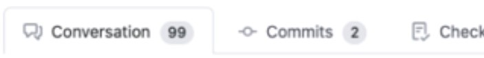

> 이 글은 어떤식으로 개발을 했었는지 정리하고 공유를 드리는 글 입니다.

## "같이" 코딩을 한다. ?
&nbsp;&nbsp;첫 회사에 입사하여 갈수록 머리가 빠지는 개발자가 되어가는 첫 걸음을 떼었을 때 혼자 개발 또는 "각개전투" 로 코드 개발하고 중요한 비즈니스 로직만 간단히 설명하는 것으로 코드리뷰를 하고 실서버 배포를 했었습니다.

&nbsp;&nbsp;이때 당시에는 git을 당연히 잘 활용 못 하였고 개발 문화라는 것에도 무지했고 당연스레 개발방법론에는 관심이 1도 없었습니다. 하지만 연차와 같이 머리카락이 점점 더 빠질 때쯤, "개발을 한다. = 코딩을 한다." 에서 "개발을 한다. = 같이 코딩을 한다." 로 느끼게 되었던 것 같습니다.

## 어떻게 개발 했었나?
&nbsp;&nbsp;개발부서 내 프론트엔드, 벡엔드, 기획자, 디자이너로 구성되어 팀이 운영되었고, 큰 틀은 애자일 방법론을 따랐고 반복된 주기('스크럼' 또는 '스프린트')를 통해서 프로젝트의 방향과 목표를 정하면서 개발 했습니다.

반복된 주기의 순서는 아래와 같습니다.

- 매 2주의 첫번째 주 월요일 계획 회의를 합니다.
- 개발을 진행합니다.
- 매 2주의 마지막 주 금요일 회고를 합니다.

&nbsp;&nbsp;계획회의 에서는 2주 동안 프로젝트에서 무엇을 완료할지 목적을 정하고 일('Task')을 나눕니다. 그리고 개발자는 planning poker 를 통해 각 테스크에 포인트를 산정합니다. 어떤 개발자는 1 포인트를 어떤 개발자는 0.5 포인트를 또 어떤 개발자는 2 포인트를 서로 의견이 다르면 맞을 때까지 논의하면서 포인트를 산정합니다.

&nbsp;&nbsp;위 방법으로 모든 테스크의 포인트를 산정하고 각자 일을 나눠가지면서 한 팀에서 1주기에 얼마의 포인트를 빼는지 측정하는 수치로 두게 됩니다.
(어떤 팀은 거의 반나절을 계획회의 하는데 시간을 쓰기도 했었습니다.)

> Planning Poker에는 scrum time 이라는 어플을 이용했습니다.

&nbsp;&nbsp;계획회의를 마치고 2주의 한 스프린트, 스크럼 기간 동안 개발을 열심히 합니다.

&nbsp;&nbsp;회고 마지막 주 금요일 개발자들은 모여서 잘한점, 못한점, 아쉬운 점을 논의하고 문서화 합니다. 중요한 점은 한 스프린트에 총합 몇 포인트를 산정했고 결과는 어떠했는지에 대해 자잘못을 따지는 자리가 되면 안되고 개발자간의 Align을 맞추는 대화가 오가야 된다는 점 입니다.

> 거의 모든 팀이 대부분의 스프린트 계획회의 때 정한 포인트를 완벽하게 소화하지 못했습니다. 개발자들의 게으름이 원인은 절대 아니었고 코드리뷰가 오래 걸리거나 hotfix 건의 버그 수정이 생기는 등 이유는 많았습니다. 정.말.로

## Git 관리 & 사용을 어떻게 하였나?
&nbsp;&nbsp;앱 개발과 웹 개발의 깃 전략 플로우는 달랐지만, 대부분의 팀이 Github flow를 따랐습니다. 메인테이너가 master 브랜치를 관리하고 git 히스토리가 꼬였을 경우 정리합니다.


&nbsp;&nbsp;각 개발자들은 할당된 깃헙 이슈(테스크)를 기준으로 브랜치를 생성, 각자 로컬환경에서 개발을 합니다. 테스크의 단위, 변경된 코드의 사이즈가 클 경우는 무조건 브랜치를 나눕니다.

> 예시)<br />
> - 팀명의 약자 명칭은 BOT 이다.<br />
> - github issue 번호가 450 이다.<br />
> - feature 개발을 하는 테스크 이다.
>
>위 와 같은 조건이라면 브랜치 명은 `feat/BOT-450-${하는 업무 내용 간략하게}` 이런식으로 브랜치를 만들었습니다.

&nbsp;&nbsp;위 예시처럼 브랜치를 생성한다면, 어떤 팀에서 어떤 깃헙 이슈로 어떤 개발을 그리고 어떤 업무를 했는지 브랜치명으로 확인되는 장점이 있습니다. 

&nbsp;&nbsp;각 개발자는 개발을 마치고 자신에게는 assigner를 팀원들에게 reviewer를 할당하고 pull request 생성합니다.

- 프론트엔드 벡엔드 구분 없이 리뷰를 받습니다.
- 디자이너에게도 ui 리뷰를 받습니다. (없을 경우 생략 가능)
- 기획자에게 ux, flow 리뷰를 받습니다. (없을 경우 생략 가능)

&nbsp;&nbsp;모든 pull request의 코드 리뷰는 궁금한 점, 제안드릴 부분, 버그로 보이는 부분 등 코멘트로 주고 받았습니다.

>의견 조율이 잘 안되는 경우, 단 두개 커밋의 리뷰에도 100 코멘트 가까이 주고받은 적도 있었습니다.

<br/>

&nbsp;&nbsp;리뷰의 모든 코멘트 사항을 각 커밋단위로 고치고 rebase, force-push로 커밋을 재정리하고 리뷰어들의 과반수 approve 승인을 받으면 master에 rebase merge 했었습니다.

&nbsp;&nbsp;위 방식으로하면 개발이 너무 느려지는 것 아닌가? 라고 생각이 드실 수도 있습니다.

맞습니다. 시간이 정말 오래 걸렸습니다. 하지만 초반에만 팀의 코드 컨밴션이나 개발자 간의 의견을 조율하는데 있어서 어떤 식으로 코멘트를 주고받을지에 대해서 팀내 설정이 안 되어있었기 때문에 처음에만 느렸고, 시간이 갈수록 개발 속도는 빨라지고 코드 리뷰의 질은 높아졌습니다.

### 코멘트를 주고 받을 때, 주의할 점

- 코드가 이해가 안되거나 궁금한 부분에 대한 코멘트는 언제든지 환영한다.
- 코드리뷰를 하면서 의견을 제시할 때는 이유는 꼭! 적는다. (어떠한 방향으로 코드를 짜면 좋은지 예시까지 있다면 더더욱 좋다.)
- 코드리뷰에 코드만 리뷰하는 것이 아니라, 커밋 메시지도 리뷰를 한다. (타이틀이 올바른지 설명란이 올바른지 ref link는 잘 기재되어있는지)
- 모든 코멘트는 상대방이 기분이 나쁘지않도록 "배려" 가 들어간다.

### 커밋 룰
[commitlint](https://github.com/conventional-changelog/commitlint) 를 기본 적용하였습니다.

- 모든 커밋은 프로젝트가 정상동작해야한다. 예시) feat: 타이틀 컴포넌트 추가
- 모든 커밋 제목에는 이슈 타입을 붙인다. 예시) feat: ~~, fix: ~~
- 설명은 제목과 한 줄 띄어쓴다.
- 부가적인 설명이 필요없는 경우 생략 가능하다.
- 설명은 커밋을 보고 어떤 작업내용인지 확인이 가능하게 자세히 적는다.
- 레퍼런스 링크는 설명과 한 줄 띄어쓴다.

```
feat: 타이틀 컴포넌트에 닫기 props 전달 추가

- 글로벌 스토어의 ~~ 를 ~~ 하여 ~~ 컴포넌트에 추가
  - 닫기 값을 전달하여 ~~ 하게 한다.

ref: ~~~
related issue: #420
```

-------

&nbsp;&nbsp;위 처럼 개발하는 것이 정답이거나 옳은 것이 아닙니다.

&nbsp;&nbsp;회사마다 개발 문화가 다르고, 같은 회사 안에 팀마다 개발 문화가 다를 수 있습니다. `(다르다 !== 틀리다)` 어떻게 하면 같이 재미있게 멋지게 개발할 수 있는지 고민하고 얘기하는 것이 좋아서 쓴 글입니다.