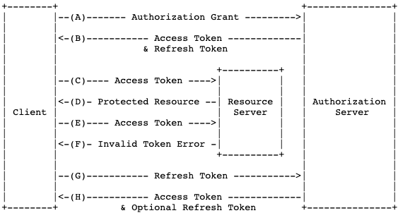

## OAuth의 사용 목적
예를들어, 페이스북 유저가 페이스북의 특정 서비스를 쉽게 사용하기위해 제 3의 서비스를 사용한다고 하면,
아이디, 비밀번호를 공유하면 가장 쉬운방법으로 내 아이디를 제 3의 서비스가 해당 유저 페이스북 계정에 접근이 가능하지만, 위험한 방법이므로 OAuth를 통해서 접근하도록 한다. OAuth를 통해 Access Token 을 얻고 이를 통해서 데이터를 접근 수정 삭제하도록 가능하게 한다.

### 역할

- Resource Owner<br/>
  자원의 소유자, 유저, 사용자
- Client<br/>
  클라이언트와 서버 사이의 해당 자원을 가져다 쓰는 제 3자, 서드 파티 서비스 (내서비스)
- Resource Server, Authorization Server<br/>
  리소스 제공자 (구글, 페이스북, 인스타그램)<br/>
  Resource Server는 데이터를 가지고 있고 Authorization Server는 인증과 관련된 사항을 가지고 있다.
  
Resource Owner와 Resource Server는 원래 Client 와 Server의 관계였지만 서드 파티 라이브러리('앱')을 깔아서 내 정보를 이용해서 특정 API를 사용할 수 있게 하면 (인증 동의) 이 앱은 Client 로서 자격을 위임받은 것 이다.

### 절차

Client는 Resource Server에 기본적인 구조로 3개 Client ID, Secret key, Authorized redirect URLs 를 보내게 된다. 추후 'Authorization Code'와 'Access Token' 를 redirect url로 전달 받는다.<br/>

Resource Server의 A,B,C,D 기능 중 B,C 기능만 클라이언트에서 사용한다면 해당 기능만 권한이 있는 인증을 하면 된다.<br/>

예로들어 "https://resource_server?client_id=1&scope=B,C&redirect_url=https://client/callback" 같은 주소로 Resource Owner 가 Resource Server로 접속을하면 현재 로그인 여부를 확인하고 로그인이 안되어있으면 로그인 페이지를 보여주고 로그인 후 해당 클라이언트 ID 여부를 확인하고 접속 시도 Redirect Url과 등록된 클라이언트 Redirect Url과 동일한지 확인 하고, 같다면 사용하고자하는 기능 스코프를 허용할 것인지 유저에게 확인하는 페이지를 보여주고 유저가 동의하면 해당 스코프 동의에 대한 정보 데이터를 저장.<br/>

Access token을 발급 전 임시 비밀번호로 Authorization code를 Resource server는 Resource Owner에게 전달한다. 등록된 리다이렉트 URL과 같이, "https://client/callback?code=3" 이 처럼 전달을 받은 사용자(Resource Owner)는 해당 주소로 클라이언트에 접속하고 code를 전달받은 Client는 이제 Resource Owner를 거치지 않고 Resource Server에 Owner의 정보를 사용하도록 인증받는 과정을 진행한다. 클라이언트는 client_id, secret key, code, redirected url 총 4개를 서버에 전달하고 서버는 모든 정보가 맞는지 확인 후 다 맞다면 Access token을 발급한다.<br/>

Access Token을 발급하기 전 이미 인증하는데 사용된 Authorization code를 지우고, token을 클라이언트에 발급한다. 이제 클라이언트는 해당 토큰으로 User의 정보로 기능 B, C를 사용할 수 있다.<br/>

#### API

2가지 방법을 따른다.<br/>
Header option (표준화 방식)
```
curl -H "Authorization: Baerer <access_token>" https://~~~
```
Parameter option
```
curl https://~~~?access_token=<access_token>
```

### Refresh Token



access token의 유효기간이 지나면 invalid token error를 클라이언트에 반환하게 되고 클라이언트는 refresh token으로 다시 access token을 발급 받는다.


----------

### 출처

- [생활코딩](https://opentutorials.org/course/3405/22004)
- [RFC - 6749](https://tools.ietf.org/html/rfc6749#section-1.5)
