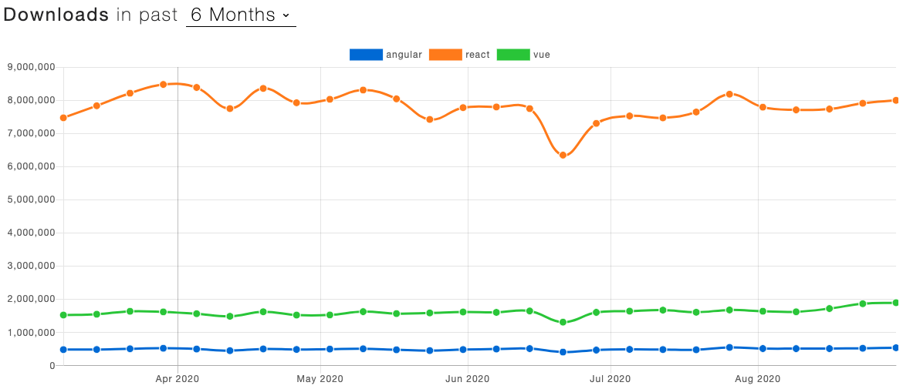

> "어떤 프레임워크가 제일 좋다" 라는 글이 아닌, "OOO한 이유로 나는 OOO 를 선택했다." 라는 글입니다. 
당연히 이 글이 정답이 아니며, 프로젝트의 프론트엔드 스팩을 정의할 때 저의 생각을 더 잘 전달하기 위해서 정리한 글 입니다.

## 리엑트 뷰 앵귤러 무엇이 좋은 선택일까?

&nbsp;&nbsp;기술을 선택함에 있어서 당연히 정답은 없는 것이, 프로젝트의 사이즈나 목적 또는 부가적인 기술 환경 등등 많은 요인에 따라서 선택의 기준이 달라지기 때문에 정답이 없지만... 
이 글의 결론을 말씀드리자면, 저는 `React vs Vue vs Angular` 라는 선택지에서, React를 선택합니다. 
주관적인 선택기준은 아래와 같습니다.

0. "대세는 무엇인가?", 인기가 가장 많은 프레임워크는?
1. 어느 회사에서 해당 프레임워크를 쓰고 있는가 & 누가 만들었는가?
2. 얼마나 해당 기술의 커뮤니티가 활성화가 되어있는가?

### 인기가 가장 많은 프레임 워크는? "대세를 따르자"
&nbsp;&nbsp;수 많은 개발자들을 상대로 이 글의 주제`(React vs Vue vs Angular)`와 동일한 질문을 받았을 때, 만약 프론트엔드 생태계에 이미 인기가 가장 많은, 대세로 꼽히는 기술이 있는 상태이고 질문 받은 개발자의 마인드가 "대부분은 A를 선택하지만 나는 B를 선택헤서 선두주자로 프론트엔드 개발 생태계를 주도 해보겠어!!" 가 아니라면 굳이 대세를 따르지 않을 이유는 없다고 생각합니다.

npm download 수치를 보면 React가 월등히 높은 것을 볼 수 있습니다. (*Star 수는 Vue가 더 높습니다...) 
[출처 : npm trends](https://www.npmtrends.com/angular-vs-react-vs-vue)

>[2019 State of JavaScript report](https://2019.stateofjs.com/front-end-frameworks/) 를 보면, 설문에 참여한 개발자 중 71%가 `React를 다시 사용했으며 다시 사용할 것` 이라고 말한 것으로 가장 높은 수치이고, Vue가 40%, Angular가 21%인 순서를 보입니다.

&nbsp;&nbsp;또한, 책상 앞에 앉아 열심히 일하는 개발자가 몸값을 올리기 위해 또는 개발 회사의 중요 부품(?)이 되기 위한다면 인기가 많은 기술을 고르는 것도 좋은 이유가 될 수 있다고 생각합니다.
> [Google > Frontend framework job trend](https://trends.google.com/trends/explore?cat=31&q=Vue%20jobs,React%20jobs,Angular%20jobs) 수요는 Vue가 가장 낮습니다.

### 어느 회사에서 해당 프레임워크를 쓰고 있는가 & 누가 만들었는가?
&nbsp;&nbsp;고르려고 하는 기술 배후에 어떤 기업이 서포트를 하는지 그리고 사용을 하는지를 알면 그 기술의 안정성 사용성을 같이 고려하는 기준이 될 수 있다고 생각합니다.  
&nbsp;&nbsp;아무리 좋은 프레임워크, 라이브러리라도 기술의 향상이 없고, 사용이 안 되어서 빠르게 변화하는 프론트엔드 생태계에 맞추지 못하고 무뎌진다면 선택의 가치는 따져볼 필요가 없다고 생각합니다.

#### 대표적인 회사 & 개발
| |React|Vue|Angular|
|:-:|:-:|:-:|:-:|
|사용|Facebook, Uber, Netflix|Alibaba, Xiaomi, GitLab|Google, Wix|
|개발|Facebook|Evan You (구글 출신 개발자)|Google|

#### 버전관리에 대한 개인적인 생각
&nbsp;&nbsp;React는 꾸준한 개발을 통해 2018년 16버전이 나오고 계속 발전을 해오는 반면 `(React Native는 아직 major버전이 0 이라는게 참담하지만..)` 오픈소스 커뮤니티 주도하에 개발되는 Vue는 아직 2에 머무르고 있어서 확실히 한 기업이 주되게 개발 기여하는 React나 Angular 보다는 느리다고 생각이되고, Angular는 버전 1에서 현재 10까지 꾸준히 개발은 되어오고 있지만 1에서 2로 major 버전이 올라가면서 완전 다른 방향으로 코드의 컨샙이 바뀐점`(1에서 2로 넘어가면서 AngularJS에서 JS 네이밍이 빠졌습니다.)` 등 이전버전에서 최신 버전으로 마이그레이션 하는데 이슈가 다른 프레임워크보다는 많은 것 같습니다.

### 얼마나 해당 기술의 커뮤니티가 활성화가 되어있는가?
&nbsp;&nbsp;위 인기에 대해서 쓴 글에도 볼 수 있듯이 가장 인기가 많고 수요가 많은 React는 커뮤니티가 활발하고 다른 프레임워크보다 자유도가 높다 보니, 여러가지 라이브러리가 생겨나면서 같이 커뮤니티 또한 더욱 더 활발해지고 있다고 생각합니다.

### 추가 개인적인 리엑트 장/단점

#### 장점
- 버전 업그레이드를 하더라도, [코드의 안정성](https://reactjs.org/docs/design-principles.html#stability)을 가장 중요하게 생각하는 리엑트라서, 버전 마이그레이션의 이슈가 적습니다.
- 컴포넌트 요소를 정의하는 코드가 직관적이고 간결하다. Html을 대체하는 JSX 사용으로 JS 파일 내에서 돔 요소를 그리다 보니, 작은 요소로 쪼개고 컴포넌트의 의미를 명시하기가 수월한 것 같습니다.
- React v16.8 이후 `hook` 도입으로 더 간단하게 라이프싸이클을 구현할 수 있게 되어, 비즈니스 로직 코드가 더욱 간결하게 구현할 수 있어졌습니다.

#### 단점
- 자유도가 높은 프레임워크이고, 기본적으로 제공하는 기능이 적다 보니, Routing, State 관리 등 부가적인 라이브러리를 많이 붙여야 합니다.
- 위 이유로, 라이브러리 선택에서 러닝 커브가 달라지기도 합니다.

