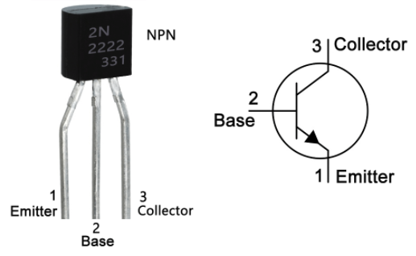
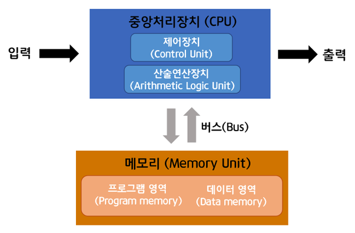

## 비트 & 트랜지스터

> 연산을 수행하는 가장 기본이 되는 소자

컴퓨터는 수없이 많은 트랜지스터를 사용해 연산한다. 구성은 성질이 다른 2가지 실리콘으로 N형과 P형을 겹쳐서 만든다. 
가운데 P형 부분을 베이스Base, 양쪽을 이미터Emitter, 콜렉터Collector 라고 부른다.

### 트랜지스터 0 / 1
> 증폭/스위치 2가지 기능을 제공하지만 컴퓨터에서는 증폭보다는 스위치로 주로 사용된다.

트랜지스터 가운데 베이스 영역인 P형 실리콘이 전하의 흐름을 방해하는 역할로 베이스 부분에 전압을 가하는 여부에 따라서 스위치 기능을 할 수 있다. 
이 같은 방법으로 0 또는 1로 숫자 표현을 하게 되고 둘 중 하나의 숫자값을 나타내는 공간을 1비트라고 부른다.

### 2진수
컴퓨터는 1과 0으로 모든 수를 표현하므로 숫자 10개를 사용해서 수를 표현하는 10진수와 다르게 숫자 2개로 표현하는 것을 2진수라고 한다.

트랜지스터 1개는 0,1을 표현할 수 있고 2진수로 한자리를 차지하기 때문에 만약 `11011` 이라는 숫자 (10진수로 27)를 표현하려면 5개의 트랜지스터가 필요하다.

> 2진수로 한자릿수를 표현하는것을 1 비트bit 라고 말한다.

### 비트 계산
1비트가 8개 모인 8비트를 1바이트byte 
1바이트가 1,024개 모인 것을 1킬로바이트KB 

> 1byte = 8bit 
1 KB = 1,024 byte 
1 MB = 1,024 KB 
1 GB = 1,024 MB 
1 TB = 1,024 GB 
1 PB = 1,024 TB 
1 ZB = 1,024 PB

## 트랜지스터에서 계산기
### 논리소자
대표적인 논리 소자로 AND, OR, XOR, NOT 가 있다.
> AND: 두 입력이 모두 1이면 1을 하나라도 0이면 0 반환 
OR: 두 입력 중 하나라도 1 이면 1을, 모두 0이면 0을 반환 
XOR: 두 입력이 서로 다르면 1을 같다면 0을 반환 
NOT: 입력이 하나로 0이면 1을 1이면 0을 반환

## 컴퓨터, 폰 노이만 구조
> 폰 노이만 구조는 현대 컴퓨터에서 모두 사용하는 기본적인 구조

`이미지 출처: 과학기술정보통신부 블로그`

CPU(중앙에 연산을 담당하는 중앙처리 장치), memory(기억 장치) 그리고 입력과 출력을 담당하는 외부 입출력 장치로 구조가 이루어져 있다.

프로그램이란 메모리에 올라가서 CPU에 명령어를 순차적으로 제공하는 명령어 묶음이다.

### 컴퓨터 동작 원리

1. 프로그램 로드 
운영체제에서 프로그램 실행 파일을 메모리에 복사(Load)
2. 데이터 로드 및 캐싱 
CPU가 연산처리 내부 캐시라는 별도 메모리 공간으로 데이터 임시보관, 램 메모리보다 적은 공간이지만 빠른 속도 지원 *메모리에서 연산에 필요한 데이터를 캐시로 복사할 때, 필요한 부분 근처의 데이터도 같이 복사.
3. 연산 및 저장 
CPU는 연산에 사용할 데이터를 레지스터로 복사해서 실제 연산이 수행(32비트/64비트), 연산 결과를 메모리에 저장

> 캐시미스: 캐시에 필요한 데이터가 없을 경우 캐시를 비우고 다시 메모리에 연산에 필요한 데이터를 복사하는 것을 캐시 미스/캐시 실패 라고 부른다.

4. 프로그램 종료 때까지 2~3번 반복

--------

출처: [『Tucker의 Go 언어 프로그래밍』](http://www.yes24.com/Product/Goods/99108736) 
저자: [YouTube, Tucker Programming](https://www.youtube.com/channel/UCZp_ftx6UB_32VfVmlS3o_A)