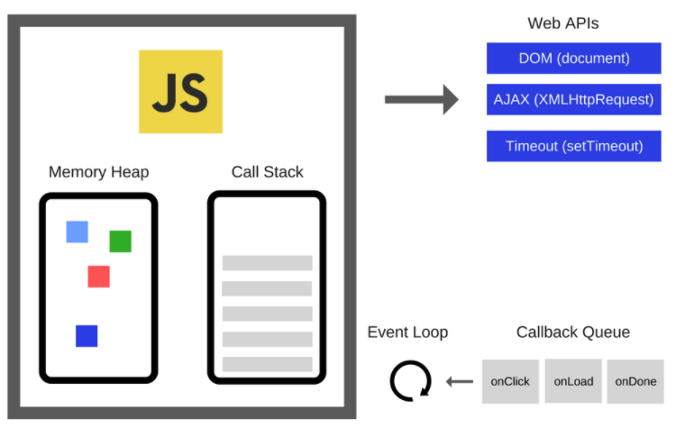
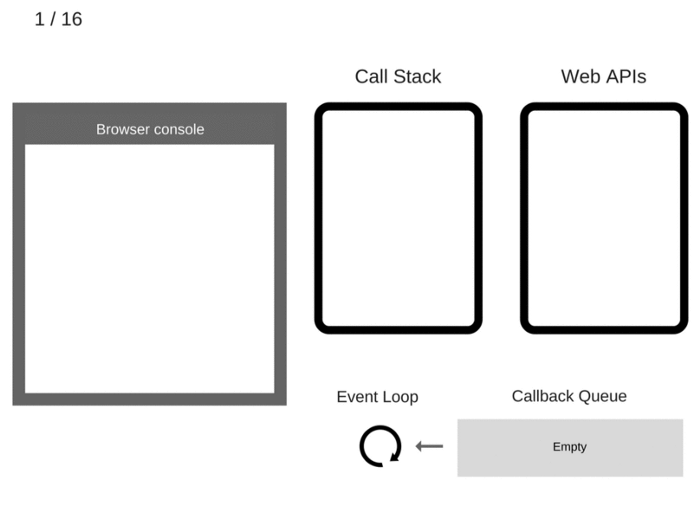

## 자바스크립트의 이벤트 루프



### 자바스크립트 엔젠 - WEB API
- Call Stack, Memory Heap으로 구성된 자바스크립트 엔진
  - Call Stack: 코드가 쌓이는 곳, Stack 구조 선입후출 구조
  - Memory Heap: 메모리 할당이 일어나는 곳
- WEB API, 자바스크립트 엔진 외부 브라우저에서 제공하는 API
  - DOM, Ajax, Timeout 등



```js
let count = 0;
while (count < 10000) {
  count ++;
  console.log(count);
}
setTimeout(() => alert('setTimeout!'));
// = 10000 까지 찍히고 셋타임아웃 실행.
// = call stack 이 끝나면 call queue에 담긴 alert() 가 스텍에 담기고 실행으로 마무리
```

### 순서
1. 코드 실행으로 Call Stack 에 쌓인다.
2. Stack은 선입후출 자료구조로 마지막에 들어온 함수가 제일 먼저 실행된다.
3. Call Stack에 쌓여진 함수가 모두 실행되면 비동기 함수가 실행된다. (Web API)
4. 비동기 함수의 콜백함수를 Callback Queue에 밀어넣는다.
5. Event loop가 반복적인 행동 Tick을 진행한다. (Call Stack <- Callback queue)

#### Event Loop - Tick
이벤트 루프는 Call Stack, Callback Queue의 상태를 체크하고 Call Stack이 빈 상태가 되면, Callback Queue의 첫번째 콜백을 Call Stack으로 밀어넣는다. 이러한 반복적인 행동을 틱(tick) 이라 지칭한다.

## 콜백 사용하기

비동기 자바스크립트 프로그램의 기본 단위는 Callback 이다.

- 간단한 비동기 작업에는 콜백을 사용한다.
- 간단한 동작에는 콜백이 적합할 수 있지만, 비동기 작업이 여러 개로 늘어나면 문제가 금방 복잡해진다. (= 콜벡 지옥)

```ts
function readFile(
  path: string,
  options: { encoding: string, flag?: string },
  callback: (err: Error | null, data: string | null) => void
): void
```

## 프로미스로 정상 회복하기

```ts
type Executor<T, E extends Error> = (
  resolve: (result: T) => void,
  reject: (error: E) => void
) => void;
class Promise<T, E extends Error> {
  constructor(f: Executor<T, E>) { }
  then<U, F extends Error>(g: (result: T) => Promise<U, F>): Promise<U, F>
  catch<U, F extends Error>(g: (error: E) => Promise<U, F>): Promise<U, F>
}
// Promise<number>, Promise<string>
```
- then: 성공한 Promise의 결과 T를 새로운 Promise로 매핑
- catch: 실패한 Promise의 에러 E를 새로운 Promise로 매핑

위 코드의 경우 Promise가 실패하면 항상 Error로 떨어트려야 하므로 throw 로 에러를 던지는 코드인 경우 거부의 결과가 Error의 서브타입이 아니기 때문에 모든 프로미스 코드에는 try/catch로 throw Error를 잡아야한다. 때문에 아래와 같이 코드를 바꾼다.

```ts
type Executor<T> = (
  resolve: (result: T) => void,
  reject: (error: unknown) => void
) => void;
class Promise<T> {
  constructor(f: Executor<T>) { }
  then<U>(g: (result: T) => Promise<U>): Promise<U>
  catch<U>(g: (error: unknown) => Promise<U>): Promise<U>
}
```

### 예시 코드
```ts
new Promise<boolean | string>((resolve, reject) => {
  const random = Math.random() * 10;
  if (random > 5) {
    resolve(true);
    return;
  }
  reject("5 보다 작음");
})
.then(res => console.log('res', res))
.catch(err => console.error('err', err));
```

## async 와 await

동기 작업이 이루어지듯이 비동기 작업을 하게해주는 async/await는 then/catch가 필요없고, 에러를 잡을때 try/catch를 사용한다. Promise보다 구현 및 가독성이 좋다.

### 예시 코드
```ts
interface Employee {
  id: number;
  employee_name: string;
  employee_salary: number;
  employee_age: number;
  profile_image: string;
}

const fetchEmployees = async (): Promise<Array<Employee> | string> => {
  const api = 'http://dummy.restapiexample.com/api/v1/employees';
  try {
    const response = await fetch(api);
    const { data } = await response.json();
    return data;
  } catch (error) {
    if (error) {
      return error.message;
    }
  }
};
```
------

## 출처

- [참고 블로그 : 이벤트 루프](https://velog.io/@thms200/Event-Loop-%EC%9D%B4%EB%B2%A4%ED%8A%B8-%EB%A3%A8%ED%94%84)
- [참고 블로그 : 자바스크립트 동작](https://engineering.huiseoul.com/%EC%9E%90%EB%B0%94%EC%8A%A4%ED%81%AC%EB%A6%BD%ED%8A%B8%EB%8A%94-%EC%96%B4%EB%96%BB%EA%B2%8C-%EC%9E%91%EB%8F%99%ED%95%98%EB%8A%94%EA%B0%80-%EC%9D%B4%EB%B2%A4%ED%8A%B8-%EB%A3%A8%ED%94%84%EC%99%80-%EB%B9%84%EB%8F%99%EA%B8%B0-%ED%94%84%EB%A1%9C%EA%B7%B8%EB%9E%98%EB%B0%8D%EC%9D%98-%EB%B6%80%EC%83%81-async-await%EC%9D%84-%EC%9D%B4%EC%9A%A9%ED%95%9C-%EC%BD%94%EB%94%A9-%ED%8C%81-%EB%8B%A4%EC%84%AF-%EA%B0%80%EC%A7%80-df65ffb4e7e)
- [How JavaScript works: an overview of the engine, the runtime, and the call stack](https://blog.sessionstack.com/how-does-javascript-actually-work-part-1-b0bacc073cf)
- [typescript: async await](https://blog.logrocket.com/async-await-in-typescript/)