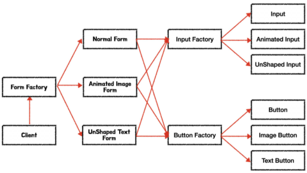

> 객체 지향 프로그래밍 언어에서는 클래스란 필수 양식과도 같은 존재이다.

## 클래스와 상속

### 기본예시
```ts
type Color = 'Black' | 'White'
type File = 'A' | 'B' | 'C' | 'D' | 'E' | 'F' | 'G' | 'H'
type Rank = 1 | 2 | 3 | 4 | 5 | 6 | 7 | 8
// 모든 값을 타입 리터럴로 직접 열거한다. (=) 제한을 두어서 타입 안전성을 확보한다.

class Position {
  constructor (
    private file: File,
    private rank: Rank
    /**
     * 생성자의 private 접근 한정자는 자동으로 매개변수를
     * this에 할당하고 가시성은 private로 설정된다.
     * (=) 이 변수는 내부 인스턴스에만 서로 접근이 가능하고
     * 외부에서는 접근 불가하다.
    */
  ) {}
}

class Piece {
  protected position: Position
  /**
   * protected 도 private와 같이 this 에 할당하지만,
   * 내부 인스턴스 끼리의 접근 + 서브 클래스의 인스턴스 모두
   * 접근을 허용한다.
  */
  constructor (
    private readonly color: Color,
    /**
     * private 해당 인스턴스 내부에서만 접근하도록 하며,
     * readonly 한정자 추가로, 초기에 할당된 값을
     * 더 이상 덮어쓸 수 없게 한다.
    */
    file: File,
    rank: Rank
  ) {
    this.position = new Position(file, rank)
  }
}
```

### 세가지 접근 한정자
타입스크립트는 클래스의 프로퍼티와 메서드에 세 가지 접근 한정자를 제공한다.<br/>
*[Class 상속 관련 Javascript강의](https://opentutorials.org/module/4047/24619)

- public<br/>
어디에서나 접근할 수 있다. 기본적으로 주어지는 접근 수준이다.
- protected<br/>
이 클래스와 서브클래스의 인스턴스에서만 접근할 수 있다.
- private<br/>
이 클래스의 인스턴스에서만 접근할 수 있다.

### abstract 키워드, 추상 클래스, 메서드

1) 추상 클래스 : 직접 인스턴스를 생성하지 못하도록 `abstract` 옵션을 사용해서 막을수 있다. (= new 를 통해 인스턴스화 할 수 없습니다.)

```ts
abstract class Piece {
  constructor(
    // ...
  )
}

new Piece('White', 'A', 1);
// Cannot create an instance of an abstract class.ts(2511)
```

2) 추상 메서드 : 인스턴스 내 필수 구현 메서드를 지정할 수 있다. (= abstract 키워드를 붙이면 자식클래스에서 반드시 구현해야합니다.)

```ts
abstract class Animal {
  readonly sound: string;
  constructor(sound: string) {
      this.sound = sound;
  }
  bark(): void {
      console.log(`${this.sound}! ${this.sound}!`);
  }
  abstract countLegs(): void;
}
class Tiger extends Animal {
  countLegs() {
      console.log('호랑이는 다리가 4개');
  }
}
class Chiken extends Animal {
  countLegs() {
      console.log('닭은 다리가 2개');
  }
}
const animal: Animal = new Animal('어흥');
// TS2511: Cannot create an instance of an abstract class.
const tiger: Animal = new Tiger('어흥');
const chiken: Animal = new Chiken('꼬꼬댁');
tiger.bark(); // 어흥! 어흥!
chiken.bark(); // 꼬꼬댁! 꼬꼬댁!
tiger.countLegs(); // 호랑이는 다리가 4개
chiken.countLegs(); // 닭은 다리가 2개
```

#### 추상클래스 사용이유?
추상과 구체에 관해 살펴보면<br/>
구체 란 어떠한 형태가 갖추어져 있는 어떤 '것'<br/>
추상 이란 특정 부분들만을 뽑아내어 표현한 것<br/>

위 예시에서 '동물' 을 나타내는 Animal 클래스를 new(인스턴스화) 하였을 시 어떤 객체가 나오는가? 에 대한 답은 없다. 동물은 추상적이기 때문입니다.

#### 인터페이스를 사용하지 왜 추상클래스를 사용하는가?
객체지향 프로그래밍에서 상속관계를 나타내기 위함입니다. 인터페이스는 어떤 '행동'에 대한 명세일 뿐, 그 자체가 상속관계를 나타내주진 않습니다.

## super
자바스크립트처럼 타입스크립트도 super 호출을 지원한다. 자식 클래스가 부모 클래스에 정의된 메서드를 오버라이드하면 자식 인스턴스는 부모 버전의 메서드를 호출할 수 있다.

- 부모와 자식이 같은 메서드 `talk`를 가지고 있다고 가정하면, 자식 클래스에서 부모 메서드를 `super.talk`로 가져올 수 있다.

- 자식 클래스에 생성자 함수가 있다면, `super()`를 호출해야 부모 클래스와 정상적으로 연결이된다.

*super로 부모 클래스에 메서드만 접근 가능하고 프로퍼티에는 접근할 수 없다.

## this를 반환 타입으로 사용

this는 값 뿐만이 아니라 타입으로도 사용이 된다.

```ts
class Set {
  has(value: number): boolean {
    // ...
  }
  add(value: number): Set {
    // ...
  }
}

class MutableSet extends Set {
  delete(value: number): boolean {
    // ...
  }
}
```

위 같이 Set 클래스의 add 메서드가 반환 타입이 Set일 경우,
자식 클래스인 MutableSet이 add 메서드를 통해 Set을 반환하지, MutableSet을 반환 받을수 없다. 그렇다고 동일한 메서드를 매번 아래처럼 매번 오버라이드 한다면 비효율적이다.

```ts
class MutableSet extends Set {
  delete(value: number): boolean {
    // ...
  }
  add(value: number): MutableSet {
    // ...
  }
}
```

때문에, this를 반환타입으로 하여서 해결한다.


```ts
class Set {
  // ...
  add(value: number): this {
    // ...
  }
}
```

## 인터페이스
타입 별칭과 인터페이스는 문법만 다를 뿐 거의 같은 기능을 수행하고 클래스는 인터페이스를 통해 사용할 때가 많다.

### 타입 - 인터페이스 다른점 3가지

1) 타입은 타입 또는 타입 연산자를 선언할 수 있지만, 인터페이스는 반드시 형태가 나와야된다.

```ts
type A = number;
type B = A | string;
```

2) 인터페이스의 extends는 상속 개념으로 할당할 수 있는지 확인하는 반면, 타입 별칭은 타입연산자로서 override 개념으로 들어간다.

```ts
interface A {
  test(x: number): string
}
interface B extends A { // TS Error
  test(x: string): string
}
/**
 Interface 'B' incorrectly extends interface 'A'.
  Types of property 'test' are incompatible.
    Type '(x: string) => string' is not assignable to type '(x: number) => string'.
      Types of parameters 'x' and 'x' are incompatible.
        Type 'number' is not assignable to type 'string'.ts(2430)
*/

type A = {
  test: (x: number) => string,
};

type B = A | {
  test:(x: string) => string,
};
```

3) `선언 합침 'declaration merging'`, 이름과 범위가 같은 인터페이스가 여러개 있을 경우 자동으로 합쳐진다.<br/>
타입은 중복된 식별자로 에러가 난다. 물론, 인터페이스끼리 충돌도 에러로 표시된다.

```ts
interface Box {
    height: number;
    width: number;
}

interface Box {
    scale: number;
}

let box: Box = {height: 5, width: 6, scale: 10};

interface A {
  age: string;
}

interface A {
  age: number; // TS Error
}
/**
Subsequent property declarations must have the same type.
Property 'age' must be of type 'string',
but here has type 'number'.ts(2717)
*/
```

### implements

명시적으로 타입 수준의 제한을 추가해서 클래스에 완전한 타입 안정성을 제공할 수 잇다.

```ts
interface A {
  readonly value: string;
  first(T: number): string;
  second(T: string): boolean;
}
interface B {
  extra(T: boolean): void;
}

class C implements A, B {
  value = 'hi';
  first = (value: number): string => {
    return 'hi';
  };
  second = (value: string): boolean => true;
  extra = (value: boolean) => {};
}
```

### 인터페이스 vs 추상 클래스 상속
&nbsp;&nbsp;인터페이스가 범용적으로 더 쓰이지만, 쓰이는 상황에 따라 사용 목적이 다르다. 인터페이스는 어떤 특정 클래스에 타입을 정의하고자 할 때 간편하게 쓰이는 반면 여러 클래스에 공통적으로 상속을 하려하는 경우 추상 클래스를 사용한다.<br/><br/>
&nbsp;&nbsp;인터페이스는 컴파일시에만 존재하고 런타임시에 해당 코드의 자바스크립트가 존재하지 않는 반면, 타입스크립트는 자바스크립트 코드를 런타임까지 당연히 만든다.<br/><br/>
&nbsp;&nbsp;추상 클래스는 인터페이스에서 제공하지 않는 생성자, 프로퍼티&메서드 접근 한정자`(public, private, protected)`를 제공한다.

## 클래스는 구조 기반 타입을 지원한다.
타입스크립트는 클래스를 비교할 때 다른 타입과 달리 이름이 아니라 구조를 기준으로 삼는다.
(C#, JAVA, Scalar 같은 언어처럼 클래스 타입을 이름으로 지정하는 경우와 다르다. - 타입스크립트는 구조로 타입을 정의)
```ts
class A {
  call() {
    // ...
  }
}
class B {
  call() {
    // ...
  }
}
const C = (value: A) => value.call();

const a = new A;
const b = new B;

C(a); //OK. No TS Error
C(b); //OK. No TS Error
```

## 클래스는 값과 타입을 모두 선언한다.
타입스크립트의 거의 모든 것은 값 또는 타입이다.

```ts
class C {}
const c: C // 문맥상 C 클래스의 인스턴스 타입을 가르킨다.
        = new C; // 문맥상 C는 값 C를 가르킨다.

enum E { F, G };
const e: E // 문맥상 열거형 E의 타입을 가르킨다.
        = E.F; // 문맥상 E의 값을 나타낸다.

type Value = {
  [key: number]: number,
};

class Test {
  value: Value = {};
  get(key: number):number|null {
    return this.value[key] || null;
  }
  static staticFuncNotPrototype(value: Value) {
    return new Test;
  }
}

// 클래스의 인스턴스를 가르키는 타입 정의
interface Test {
  value: Value;
  get(key: number): number | null;
}

// === typeof Test
// 클래스 생성자를 가르킨다.
interface TestConstructor {
  new(): Test;
  staticFuncNotPrototype(value: Value): Test;
}
```

## 다형성
함수와 타입처럼 클래스와 인터페이스도 기본값과 상한/하한 설정을 포함한 다양한 제네릭 타입 매개변수 기능을 지원한다.

```ts
class Test<K, V> {
  // ↑ 클래스의 제네릭 선언으로 내부 메서드, 프로퍼티에 K, V를 사용할 수 있다.
  constructor (initKey: K, initVal: V) {
    /** ↑
     * constructor 생성자에는 제네릭을 사용 못하지만,
     * class 매개변수에 선언에 사용된다.
    */
  }
  func(key: K): V {
    /** ↑
     * 클래스 내 정의된 제네릭 타입을 메소드에 사용한 예시 1
    */
  }
  func2(key: K, val: V): void {
    /** ↑
     * 클래스 내 정의된 제네릭 타입을 메소드에 사용한 예시 2
    */
  }
  merge<K1, V1>(test: Test<K1, V1>): Test<K|K1, V|V1> {
    /** ↑
     * 인스턴스 메서드에 자신만의 제네릭 선언도 가능하다.
    */
  }
  static staticFunc<K, V>(key2: K, val2: V): Test<K, V> {
    /** ↑
     * static 정적 메서드는 인스턴스 매개변수 값에 접근이 안되듯이,
     * 클래스의 제네릭 타입에 접근이 안되고,
     * 인스턴스에서 다시 따로 선언을 재차 해주어야 한다.
    */
  }
}

// NOTE: 함수와 마찬가지로 타입스크립트가 클래스의 제네릭 타입을 추론할 수 있다.
const a = new Test<string, boolean>('hi', true);
// ↑ : Test<string, boolean>
const b = new Test(1, 'bye');
// ↑ : Test<number, string>

a.func('k');
b.func2(12, 'wef');
```

## 믹스인

믹스인이란 동작과 프로퍼티를 클래스로 혼합(mix)할 수 있게 해주는 패턴으로 다음 규칙을 따른다

- 상태를 가질 수 있다 (ex. 인스턴스 프로퍼티)
- 구체 메서드만 제공할 수 있다 (추상 메소드 `abstract`에는 사용 못함)
- 생성자를 가질 수 있다.

```ts
type ClassConstructor = new (....args: any[]) => {}

function withEZDebug<C extends ClassConstructor>(Class: C) {
  return class extends Class {
    debug() {
      let name = this.constructor.name;
      let value = this.getDebugValue();
      return Name + '(' + JSON.stringify(value) + ')';
    }
  }
}

class User {
  // ...
}
User.debug(); // 'User({"id": 1, "name": "Wabi"})'
```

## 데코레이터
타입스크립트가 기본으로 제공하는 데코레이터는 없기 때문에, 모든 데코레이터는 직접 구현 또는 NPM으로 설치해야 한다.<br/>
데코레이터는 아직 실험 단계의 기능으로<br/>
`"experimentalDecorators": true` TSC 플래그 추가가 필요하다.

## final 클래스 흉내내기

final class : 클래스나 메서드를 확장하거나 오버라이드할 수 없게 만드는 기능.<br/>
타입스크립트는 클래스나 메서드에 final 키워드를 제공하지 않지만 흉내내서 구현하는 것은 쉽다.

```ts
class A {
  private constructor(private val: string[]) {}
  static func(val: string[]) {
    return new A(val);
  }
}

class C extends A {}
// Cannot extend a class 'A'. Class constructor is marked as private.ts(2675)

const newA = new A([]);
// Constructor of class 'A' is private and only accessible within the class declaration.ts(2673)

const newB = A.func([]);
```

private 키워드로 비공개 생성자`private constructor`를 써서 클래스 인스턴스화 및 확장을 막을 수 있다.

## 디자인 패턴

### 팩토리 패턴
어떤 객체를 만들지를 전적으로 팩토리에 위임한다.<br/>
부모 클래스에서 타입에 따라 클래스를 생성하는 방법으로 자식 클래스를 생성하기위해 부모 클래스의 팩토리를 호출하는 방식이다.<br/>
장점으로는, 자식 클래스가 다양하게 생길때 효율적으로 관리하기 위해서 사용된다.<br/><br/>
더 나아가면, 팩토리 패턴 상위에 추상 팩토리 패턴을 두어서 팩토리 메서드를 생성하는 객체를 한곳에 모아서 관리할 수도 있다.<br/>

```ts
enum InputType {
  DEFAULT = 0,
  ANIMATED,
  UNSHAPED
}

class Input {
  public static InputFactory(type: InputType): Input {
      switch (type) {
          default:
              return new Input()
          case InputType.ANIMATED:
              return new AnimatedInput()
          case InputType.UNSHAPED:
              return new UnShapedInput()
      }
  }

  render() {
      return `<input />`
  }
}

class AnimatedInput extends Input {
  render() {
      return `<input class="animated-input" />`
  }
}

class UnShapedInput extends Input {
  render() {
      return `<input class="unshaped-input" />`
  }
}

enum ButtonType {
  DEFAULT = 0,
  IMAGE,
  TEXT
}

interface IButton {
  text: string
  src?: string
}

class Button {
  text: string

  public static ButtonFactory(type: ButtonType, text: string, src?: string): Button {
      switch (type) {
          default:
              return new Button(text)
          case ButtonType.IMAGE:
              return new ImageButton(text, src!)
          case ButtonType.TEXT:
              return new TextButton(text)
      }
  }

  constructor(text: string) {
      this.text = text
  }

  render() {
      return `<button>${this.text}</button>`
  }
}

class ImageButton extends Button {
  src?: string

  constructor(text: string, src: string) {
      super(text)
      this.src = src
  }

  render() {
      return `<button class="none">
          ${this.text}
          
      </button>`
  }
}

class TextButton extends Button {
  constructor(text: string) {
      super(text)
  }

  render() {
      return `
          <button class="none">
              ${this.text}
          </button>
      `
  }
}

interface IFormFactory {
  createInput(): Input
  createButton(): Button

  render(): string
}

class NormalForm implements IFormFactory {
  createInput(): Input {
      return Input.InputFactory(InputType.DEFAULT)
  }

  createButton(): Button {
      return Button.ButtonFactory(ButtonType.DEFAULT, 'normal')
  }

  render() {
      return `
          <div>
              ${this.createInput().render()}
              ${this.createButton().render()}
          </div>
      `
  }
}

class AnimatedImageForm implements IFormFactory {
  createInput(): AnimatedInput {
      return Input.InputFactory(InputType.ANIMATED)
  }

  createButton(): ImageButton {
      return Button.ButtonFactory(ButtonType.IMAGE, 'image', 'hihi')
  }

  render() {
      return `
          <div>
              ${this.createInput().render()}
              ${this.createButton().render()}
          </div>
      `
  }
}

class UnShapedTextForm implements IFormFactory {
  createInput(): UnShapedInput {
      return Input.InputFactory(InputType.UNSHAPED)
  }

  createButton(): TextButton {
      return Button.ButtonFactory(ButtonType.TEXT, 'text')
  }

  render() {
      return `
          <div>
              ${this.createInput().render()}
              ${this.createButton().render()}
          </div>
      `
  }
}

enum FormType {
  ONE = 0,
  TWO,
  THREE
}

class Form {
  public static FormFactory(type: FormType) {
      let factory: IFormFactory | null = null

      switch (type) {
          case FormType.ONE:
              factory = new NormalForm()

              break;
          case FormType.TWO:
              factory = new AnimatedImageForm()

              break;
          case FormType.THREE:
              factory = new UnShapedTextForm()

              break;
      }

      return factory.render()
  }
}

console.log(Form.FormFactory(FormType.ONE))
console.log(Form.FormFactory(FormType.TWO))
console.log(Form.FormFactory(FormType.THREE))
```


### 빌더 패턴
객체의 생성과 객체 구현방식을 분리할 수 있다. 복잡한 객체를 생성하는 방법과 표현하는 방법을 정의하는 클래스를 별도로 분리하여, 서로 다른 표현이라도 이를 생성할 수 있는 동일한 절차를 제공할 수 있도록 한다.

```ts
interface PowderedMilkMaker {
  setBottle(): void;
  setWater(): void;
  setTemperature(): void;
  setPowder(): void;
}

type PowderedMilkMaterial = 'Bottle' | 'Water' | 'Temperature' | 'Powder';

class PowderedMilk {
  private value: { [key: string]: string } = {};
  set(key: PowderedMilkMaterial, value: string): this {
    this.value[key] = value;
    return this;
  }
  get(): string {
    const text = Object.keys(this.value).map(k => `${k}는 ${this.value[k]} 입니다.`).join('\n');
    return `이 밀크파우더는 아래와 같습니다.\n${text}`;
  }
}

class BabyPowderedMilkMaker implements PowderedMilkMaker {
  private powderedMilk: PowderedMilk = new PowderedMilk();
  public reset() {
    this.powderedMilk = new PowderedMilk();
  }

  setBottle() {
    this.powderedMilk.set('Bottle', '260ml 병');
  }
  setWater() {
    this.powderedMilk.set('Water', '160ml');
  }
  setTemperature() {
    this.powderedMilk.set('Temperature', '45도');
  }
  setPowder() {
    this.powderedMilk.set('Powder', '분유 3스푼');
  }

  getPowderedMilk(): PowderedMilk {
    const result = this.powderedMilk;
    this.reset();
    return result;
  }
}

class ProteinPowderedMilkMaker implements PowderedMilkMaker {
  private powderedMilk: PowderedMilk = new PowderedMilk();
  public reset() {
    this.powderedMilk = new PowderedMilk();
  }

  setBottle() {
    this.powderedMilk.set('Bottle', '1L 병');
  }
  setWater() {
    this.powderedMilk.set('Water', '450ml');
  }
  setTemperature() {
    this.powderedMilk.set('Temperature', '55도');
  }
  setPowder() {
    this.powderedMilk.set('Powder', '프로틴 5스푼');
  }

  getPowderedMilk(): PowderedMilk {
    const result = this.powderedMilk;
    this.reset();
    return result;
  }
}

const nanny = new BabyPowderedMilkMaker();
nanny.setBottle();
nanny.setWater();
nanny.setTemperature();
nanny.setPowder();
const trainer = new ProteinPowderedMilkMaker();
trainer.setBottle();
trainer.setWater();
trainer.setTemperature();
trainer.setPowder();

const nannyBottle = nanny.getPowderedMilk().get();
const trainerBottle = trainer.getPowderedMilk().get();

console.log(nannyBottle);
/**
이 밀크파우더는 아래와 같습니다.
Bottle는 260ml 병 입니다.
Water는 160ml 입니다.
Temperature는 45도 입니다.
Powder는 분유 3스푼 입니다.
*/
console.log(trainerBottle);
/**
이 밀크파우더는 아래와 같습니다.
Bottle는 1L 병 입니다.
Water는 450ml 입니다.
Temperature는 55도 입니다.
Powder는 프로틴 5스푼 입니다.
*/
```

-----

### 참고도서
[타입스크립트 프로그래밍](http://www.yes24.com/Product/Goods/90265564)
### 참고링크
[타입스크립트 핸드북 : classes](https://typescript-kr.github.io/pages/classes.html)
[enum을 사용하는 이유](https://medium.com/@seungha_kim_IT/typescript-enum%EC%9D%84-%EC%82%AC%EC%9A%A9%ED%95%98%EB%8A%94-%EC%9D%B4%EC%9C%A0-3b3ccd8e5552)
[타입스크립트 클래스 블로그글](https://heecheolman.tistory.com/65)
[자바스크립트 Class 소개](https://lacommune.tistory.com/170)
#### class static
```js
class PersonClass {
    // PersonType constructor와 동일합니다.
    constructor(name) {
        this.name = name;
    }
    // PersonType.prototype.sayName와 동일합니다.
    sayName() {
        console.log(this.name);
    }
    // PersonType.create와 동일합니다.
    static create(name) {
        return new PersonClass(name);
    }
}
```
[팩토리 패턴 심화](https://vallista.kr/2020/05/05/TypeScript-%EB%94%94%EC%9E%90%EC%9D%B8-%ED%8C%A8%ED%84%B4-%ED%8C%A9%ED%86%A0%EB%A6%AC-%ED%8C%A8%ED%84%B4/)