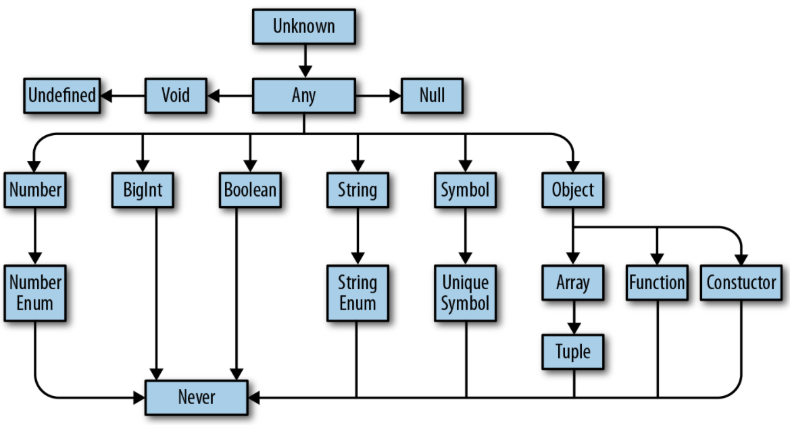

### 타입스크립트의 타입 계층


### 타입스크립트의 값 타입 추론

```typescript
let a = 3099; // number
let b = 'wabi'; // string
const c = 'study group'; // 'study group'
let d = [true, false, true]; // boolean[]
let e = {type: 'kor'}; // {type: string}
const f = {type: 'eng'}; // {type: string}
let g = [1, false]; // (number | boolean)[]
const h = [3]; // number[]
let i = null; // any
```
let, const 로 타입 추론에 있어서 차이
1. let은 타입 형을 추론.
2. const는 값을 추론하여 명시.

> 단, const 로 값을 정의해도, array와 object는 내부 타입, 좁은타입 추론은 하지 않는다.

### 인덱스 시그니처 (index signature)

`[key: T]: U` 문법으로 타입스크립트에 어떤 객체가 여러 키를 가질 수 있음을 알려준다.

```typescript
let testObj: {
  [key: number]: number
} = {
  1: 10,
  2: 20
};
```

### 타입별칭, 유니온, 인터섹션

```typescript
type Name = string;
type Person = {
  name: Name
  age: number
};
```

타입 별칭은 블록 영역에 적용 된다. (마치 let, const 처럼)

```typescript
type Name = 'wabi';

const randomFlag = Math.random() > 0.5;

if (randomFlag) {
  type Name = 'taek';
  let b: Name = 'taek';
} else {
  type Name = 'one';
  let c: Name = 'one';
}
```

#### 합집합 유니온(union), 교집합 인터섹션(intersection)

타입스크립트 타입에 연산자 `유니온(|), 인터섹션(&)` 을 지원한다.

```typescript
type TestA = {
  a: number;
  b: string;
};

type TestB = {
  a: number;
  c: number;
  d: true;
};

// 합집합 유니온(union)
const test1 = (c: TestA | TestB) => {
  c.a; // number
  c.b; // Ts Error
  // Property 'b' does not exist on type 'TestA | TestB'.
    // Property 'b' does not exist on type 'TestB'.
  c.c; // Ts Error
  // Property 'c' does not exist on type 'TestA | TestB'.
    // Property 'c' does not exist on type 'TestA'.
  c.d; // Ts Error
  // Property 'd' does not exist on type 'TestA | TestB'.
    // Property 'd' does not exist on type 'TestA'.
};

// 교집합 인터섹션(intersection)
const test2 = (c: TestA & TestB) => {
  c.a; // number
  c.b; // string
  c.c; // number
  c.d; // true
};
```

### 튜플

```typescript
let a: [number] = [1];
let b: [string, number, ...boolean[]] = ['a', 1, true, false, true];
```

읽기 전용 배열 튜플도 가능하다.

```typescript
let a: readonly number[] = [1, 2, 3];
let b: readonly number[] = a.concat(4);

type Tuple = readonly [boolean, number];

const tuple: Tuple = [true, 2];
tuple.push(444); // Ts error
// Property 'push' does not exist on type 'readonly [boolean, number]'.
// .push, .splice 처럼 내용을 바꾸는 메서드가 아닌
// .concat, .slice 같은 내용을 바꾸지 않는 메서드를 써야한다.

let c: readonly [number, boolean] = [1, true];
```

### null, undefined, void, never

|타입|의미|
|:--|:--|
|null|값이 없음|
|undefined|아직 값을 변수에 할당하지 않음|
|void|return 문을 포함하지 않는 함수|
|never|절대 반환하지 않는 함수|
